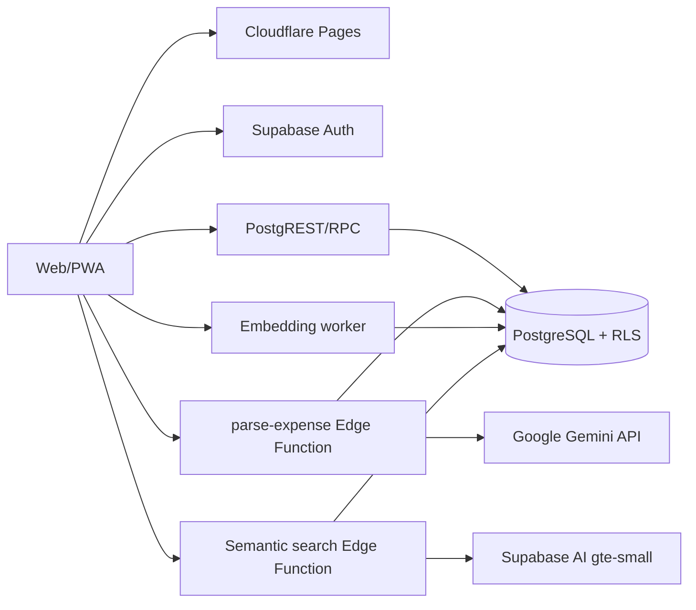

# Family Expense — Project Handoff

> Cập nhật: **04/09/2026** (`Asia/Ho_Chi_Minh`)
> Trạng thái: **Production đang hoạt động; tài liệu này là ngữ cảnh kỹ thuật cho các phiên làm việc tiếp theo**  
> Production: <https://family-expense-8fo.pages.dev>

## Trạng thái dự án

- [x] Ứng dụng production đang chạy trên Cloudflare Pages.
- [x] Mã nguồn frontend, Supabase migrations/RLS/RPC và Edge Function có trong workspace.
- [x] README, CHANGELOG và SAD đã được cập nhật.
- [x] Git remote, protected `main`, CI/CD và Cloudflare Pages Git deployment đã thiết lập.
- [x] Supabase production workflow đã kiểm tra thành công bằng `workflow_dispatch` với `dry_run=true`; không thay đổi database hoặc deploy Edge Function.
- [x] Supabase staging tách biệt đã thiết lập.
- [ ] Thực hiện backup/restore và rollback drill.

### Handoff — tăng tốc AI search (04/09/2026)

- Mục tiêu: giảm thời gian chờ khi người dùng dùng **Gợi ý AI** trên trang Giao dịch.
- Bản sửa: câu tìm kiếm chỉ gồm bộ lọc cấu trúc rõ ràng được xử lý nhanh trên client mà không gọi Gemini; các câu khác được cache theo family/ngôn ngữ/catalog/câu tìm kiếm trong 5 phút, đồng thời React Query chống gọi trùng. `keepPreviousData` giữ danh sách cũ trong khi bộ lọc mới tải.
- Files: `src/lib/quickTransactionSearch.ts`, `src/lib/quickTransactionSearch.test.ts`, `src/lib/aiClient.ts`, `src/lib/aiClient.test.ts`, `src/pages/Transactions.tsx`. Không đổi schema, RLS hoặc dữ liệu giao dịch.
- Validation: Chưa chạy; cần chạy full Vitest, typecheck, lint, build và `git diff --check`.
- Trạng thái triển khai dự kiến: Chưa deploy; chờ PR và Cloudflare Pages production deployment.

### Handoff — loại bỏ semantic search và dữ liệu embedding (04/09/2026)

- Quyết định sản phẩm: tắt semantic search khỏi giao diện sau khi parser AI vẫn chạy nhưng semantic path tiếp tục không trả kết quả ổn định trên Supabase Free.
- Bản sửa: `fetchTransactionPage` luôn dùng `list_family_transactions`; AI search bỏ `semanticQuery`, vẫn áp dụng đầy đủ bộ lọc multi-select và chỉ dùng keyword khi có từ khóa trực tiếp. Prompt parser không còn yêu cầu semantic search. Migration `202609040005_remove_semantic_search.sql` xoá bảng `transaction_embeddings`, các RPC embedding/semantic và extension `vector`; source/config/workflow gỡ hai Edge Function semantic cùng helper.
- Files: `src/pages/Transactions.tsx`, `src/lib/transactionsApi.ts`, `src/lib/ai.ts`, `src/lib/transactionsApi.test.ts`, `src/lib/ai.test.ts`, `supabase/functions/search-transactions/index.ts`, `supabase/config.toml`, `.github/workflows/supabase-deploy.yml`, `supabase/migrations/202609040005_remove_semantic_search.sql`, `supabase/tests/transaction_search_filters.sql`, `README.md`. Không đổi dữ liệu giao dịch hoặc RLS giao dịch.
- Validation: sẽ chạy lại full Vitest, typecheck, lint, build, `git diff --check` và pgTAP database tests.
- Trạng thái triển khai dự kiến: Chưa deploy production; chờ PR, required checks, migration Supabase production và Cloudflare Pages production deployment.

### Handoff — loại bỏ account và event khỏi luồng ứng dụng (04/09/2026)

- Giao diện form giao dịch, template/import hiện hành và export đã không hiển thị hai trường này; bản sửa lần này dọn nốt các tham chiếu frontend còn lại trong schema, draft, payload tạo/sao chép, parser Excel cũ và quan hệ truy vấn export.
- Không xóa bảng/cột `accounts`, `events`, `transactions.account_id` hoặc `transactions.event_id` trong database vì đây là dữ liệu/schema production có thể chứa dữ liệu cũ; các trường legacy không còn được map hoặc ghi bởi frontend.
- Files: `src/lib/domain.ts`, `src/lib/transactionDraft.ts`, `src/lib/transactionsApi.ts`, `src/pages/TransactionForm.tsx`, `src/pages/Transactions.tsx`, `src/pages/ImportExport.tsx`, `src/lib/importExcel.ts`, cùng test domain/import Excel.
- Validation: Full suite đạt 30/30 file, 124/124 test; typecheck, lint, build và `git diff --check` pass. Build vẫn cảnh báo chunk ExcelJS lớn đã có từ trước.
- Trạng thái triển khai dự kiến: Push branch, tạo/cập nhật PR vào `main`, bật auto-merge và chờ Supabase Production Deploy cùng Cloudflare Pages Git deployment.

### Handoff — giữ kết quả AI search khi backfill embedding lỗi (04/09/2026)

- Ảnh người dùng cho thấy `search-transactions` đã phân tích đúng `semanticQuery` và bộ lọc `Quần áo`, nhưng query giao dịch vẫn rơi vào lỗi tải danh sách. Nguyên nhân phù hợp với việc backfill lazy gặp giới hạn CPU trước khi semantic RPC hoàn tất.
- Bản sửa: giảm batch lazy từ 20 xuống 5, coi lỗi backfill là best-effort để vẫn chạy semantic search; truyền câu semantic vào bộ lọc từ khóa; migration `202609040004_semantic_search_missing_embeddings.sql` đổi RPC semantic sang `left join` và chấm điểm 0 cho dòng chưa có embedding, để bộ lọc cấu trúc/từ khóa vẫn trả kết quả.
- Files: `src/lib/transactionsApi.ts`, `src/lib/transactionsApi.test.ts`, `supabase/migrations/202609040004_semantic_search_missing_embeddings.sql`. Không đổi model, schema bảng embedding, dữ liệu giao dịch hay quyền RLS ngoài việc thay thế cùng RPC đã có.
- Validation: `pnpm test` đạt 30/30 file, 123/123 test; typecheck, lint, build và `git diff --check` pass. Build vẫn cảnh báo chunk ExcelJS lớn đã có từ trước.
- Trạng thái triển khai: Chưa deploy production; đang chờ PR, required checks, Supabase Production Deploy và Cloudflare Pages production deployment.

### Handoff — giảm lỗi CPU khi AI search khởi tạo embedding (04/09/2026)

- Nguyên nhân đã xác nhận từ log production: `process-transaction-embeddings` bị `546 WORKER_RESOURCE_LIMIT` / `CPU Time exceeded` khi xử lý nhiều giao dịch và tạo session embedding mới cho từng dòng; vì vậy AI search chưa bao giờ tới bước semantic search.
- Bản sửa: tái sử dụng một session `gte-small` trong Edge Function isolate để loại bỏ chi phí khởi tạo model lặp lại cho từng dòng; giữ batch tối đa 20 để semantic search vẫn bao phủ dữ liệu cần thiết. Backfill dữ liệu cũ vẫn là luồng riêng, không tự chạy hàng loạt.
- Files: `supabase/functions/_shared/transactionEmbedding.ts`, `src/lib/transactionsApi.test.ts`. Không đổi schema, RLS/RPC hay dữ liệu production.
- Validation: `pnpm test` đạt 30/30 file, 122/122 test; typecheck, lint, build và `git diff --check` pass. Build vẫn cảnh báo chunk ExcelJS lớn đã có từ trước.
- Trạng thái triển khai: Chờ PR, required checks, Supabase Production Deploy và Cloudflare Pages production deployment của merge commit.

### Handoff — highlight user hiện tại trong Thành viên (04/09/2026)

- Danh sách Thành viên hiện nhận diện dòng có `member.user_id === currentUserId` bằng nền/viền accent theo theme và badge theo ngôn ngữ (`Bạn`/`You`).
- Có accessible label `tài khoản đang đăng nhập` cho đúng dòng; không thay đổi quyền sửa/xóa hoặc luồng dữ liệu.
- Files: `src/pages/Members.tsx`, `src/index.css`, `src/context/LanguageContext.tsx`, `src/pages/Members.test.tsx`. Không có migration mới, không đổi API/schema/RLS/RPC.
- Validation: `pnpm test` đạt 29/29 file, 121/121 test; `pnpm lint`, `pnpm typecheck`, `pnpm build` và `git diff --check` pass.
- Trạng thái triển khai: Đang chuẩn bị deploy production qua PR và Git integration của Cloudflare Pages.

### Handoff — hiển thị tên người dùng và liên kết Thành viên (04/09/2026)

- Header hiện ưu tiên tên hiển thị (`family_members.display_name`) của user đang đăng nhập; nếu chưa có tên thì fallback về tên trong metadata tài khoản hoặc email.
- Tên ở header desktop và mobile có thể bấm để mở `/thanh-vien`; route Thành viên, quyền truy cập và dữ liệu thành viên không thay đổi.
- Files: `src/context/AppContext.tsx`, `src/components/Layout.tsx`, `src/context/AppContext.ui.test.tsx`, `src/components/Layout.test.tsx`. Không có migration mới, không đổi API/schema/RLS/RPC.
- Validation: `pnpm test` đạt 29/29 file, 121/121 test; `pnpm lint`, `pnpm typecheck`, `pnpm build` và `git diff --check` pass.
- Trạng thái triển khai: Đang chuẩn bị deploy production qua PR và Git integration của Cloudflare Pages.
### Handoff — hoàn thiện theme Dracula cho dark mode (04/09/2026)

- Trước thay đổi: Một số chữ phụ vẫn dùng màu light mode, trạng thái lỗi chưa có nền/chữ dark riêng, nút thao tác hàng loạt còn xanh light-theme và biểu đồ xu hướng dùng style mặc định không theo dark mode.
- Sau thay đổi: Bổ sung màu muted, lỗi, viền và hành động theo palette Dracula; palette biểu đồ, trục, grid, legend và tooltip chuyển theo biến theme; giữ nguyên light mode và quy tắc nghiệp vụ.
- Files: `src/index.css`, `src/pages/Dashboard.tsx`, `src/pages/ImportExport.tsx`, `src/pages/Transactions.tsx`, `src/pages/TransactionForm.tsx`, `src/pages/Members.tsx`, `src/pages/Catalogs.tsx`, `src/pages/Login.tsx`, `src/pages/CreateFamily.tsx`, `src/components/MultiSelectField.tsx`, `src/pages/ImportExport.test.tsx`, `src/pages/TransactionForm.test.tsx`. Không có migration mới, không đổi API/schema/RLS/RPC hoặc dữ liệu.
- Validation: `pnpm test` đạt 29/29 file, 121/121 test; `pnpm lint`, `pnpm typecheck`, `pnpm build` và `git diff --check` pass. Build còn cảnh báo chunk ExcelJS lớn đã có từ trước.
- Trạng thái triển khai dự kiến: Commit sẽ được push lên nhánh `codex/transaction-filter-ui-20260904`, tạo PR vào `main`, bật auto-merge và deploy production qua Git integration của Cloudflare Pages.

### Handoff — khắc phục AI search không tải được danh sách giao dịch (04/09/2026)

- Bảng `transaction_embeddings` trống ban đầu là đúng với thiết kế backfill lazy: chỉ khi semantic search được gọi thì Edge Function mới tạo embedding theo batch. Lỗi người dùng gặp xảy ra ở runtime semantic path, trước khi hàng được ghi thành công.
- Bản sửa: gửi vector lên RPC dưới dạng pgvector literal; dùng `md5` built-in cho `source_hash` để không phụ thuộc schema `pgcrypto`; gửi `pg_notify('pgrst', 'reload schema')` sau migration để PostgREST nhận function signature mới.
- Files: `supabase/functions/_shared/transactionEmbedding.ts`, `supabase/functions/process-transaction-embeddings/index.ts`, `supabase/functions/search-transactions-semantic/index.ts`, `supabase/migrations/202609040003_fix_transaction_embedding_runtime.sql`.
- Validation: `pnpm test` đạt 29/29 file, 121/121 test; typecheck, lint, build và `git diff --check` pass. Playwright đã khởi động được sau khi cài browser nhưng 2 test cloud bị bỏ qua vì chưa có `E2E_EMAIL`/`E2E_PASSWORD`.
- Trạng thái triển khai: Chưa deploy production; thay đổi đang được kiểm tra cùng bản sửa UI dropdown.

### Handoff — căn mũi tên cùng hàng cho bộ lọc multi-select (04/09/2026)

- Nguyên nhân: `.field` đặt `display: block` nên ghi đè `flex` trên `<summary>` của multi-select; icon mũi tên bị xuống dòng và trigger cao hơn `<select>` native.
- Bản sửa: thêm class scoped `multi-select-trigger { display: flex; }` cho trigger Mục đích, Danh mục và Phương thức thanh toán; nội dung và mũi tên giờ nằm cùng hàng, chiều cao đồng nhất.
- Files: `src/components/MultiSelectField.tsx`, `src/index.css`, `src/pages/Transactions.ui.test.tsx`, `supabase/functions/_shared/transactionEmbedding.ts`, `supabase/functions/process-transaction-embeddings/index.ts`, `supabase/functions/search-transactions-semantic/index.ts`, `supabase/migrations/202609040003_fix_transaction_embedding_runtime.sql`. Không đổi API nghiệp vụ hoặc dữ liệu giao dịch.
- Validation: `pnpm test` đạt 29/29 file, 121/121 test; typecheck, lint, build và `git diff --check` pass. Playwright đã khởi động được sau khi cài browser nhưng 2 test cloud bị bỏ qua vì chưa có `E2E_EMAIL`/`E2E_PASSWORD`.
- Trạng thái triển khai: Chưa deploy production; thay đổi đang ở workspace.

### Handoff — highlight user hiện tại trong Thành viên (04/09/2026)

- Danh sách Thành viên hiện nhận diện dòng có `member.user_id === currentUserId` bằng nền/viền accent theo theme và badge theo ngôn ngữ (`Bạn`/`You`).
- Có accessible label `tài khoản đang đăng nhập` cho đúng dòng; không thay đổi quyền sửa/xóa hoặc luồng dữ liệu.
- Files: `src/pages/Members.tsx`, `src/index.css`, `src/context/LanguageContext.tsx`, `src/pages/Members.test.tsx`. Không có migration mới, không đổi API/schema/RLS/RPC.
- Validation: `pnpm test` đạt 29/29 file, 121/121 test; `pnpm lint`, `pnpm typecheck`, `pnpm build` và `git diff --check` pass.
- Trạng thái triển khai: Đang chuẩn bị deploy production qua PR và Git integration của Cloudflare Pages.

### Handoff — hiển thị tên người dùng và liên kết Thành viên (04/09/2026)

- Header hiện ưu tiên tên hiển thị (`family_members.display_name`) của user đang đăng nhập; nếu chưa có tên thì fallback về tên trong metadata tài khoản hoặc email.
- Tên ở header desktop và mobile có thể bấm để mở `/thanh-vien`; route Thành viên, quyền truy cập và dữ liệu thành viên không thay đổi.
- Files: `src/context/AppContext.tsx`, `src/components/Layout.tsx`, `src/context/AppContext.ui.test.tsx`, `src/components/Layout.test.tsx`. Không có migration mới, không đổi API/schema/RLS/RPC.
- Validation: `pnpm test` đạt 29/29 file, 121/121 test; `pnpm lint`, `pnpm typecheck`, `pnpm build` và `git diff --check` pass.
- Trạng thái triển khai: Đang chuẩn bị deploy production qua PR và Git integration của Cloudflare Pages.

### Handoff — multi-select và semantic search giao dịch (04/09/2026)

- Đã chuyển bộ lọc Mục đích, Danh mục và Phương thức thanh toán sang chọn nhiều; nhiều giá trị trong cùng nhóm là OR, các nhóm khác là AND. Bộ lọc hoạt động cho cả demo local và RPC cloud mới.
- AI search `search-transactions` đã đổi schema sang `purposeIds`, `expenseTypeIds`, `paymentMethodIds` và thêm `semanticQuery`. UI áp dụng toàn bộ ID hợp lệ từ AI, không tự lưu giao dịch.
- Semantic search dùng `pgvector` trong Supabase Postgres, model built-in `gte-small` 384 chiều trong Edge Functions; chỉ embedding `description` + `note`. `process-transaction-embeddings` backfill lazy theo batch khi semantic search được gọi, `search-transactions-semantic` lọc cấu trúc bằng SQL rồi xếp hạng cosine similarity. Không gọi Gemini để tạo embedding.
- Files chính: `src/components/MultiSelectField.tsx`, `src/pages/Transactions.tsx`, `src/lib/transactionsApi.ts`, `src/lib/ai.ts`, `supabase/migrations/202609040002_transaction_search_semantic.sql`, `supabase/functions/_shared/transactionEmbedding.ts`, `supabase/functions/process-transaction-embeddings/index.ts`, `supabase/functions/search-transactions-semantic/index.ts`, `supabase/functions/search-transactions/index.ts`, `supabase/config.toml`, `.github/workflows/supabase-deploy.yml`.
- Validation: Vitest đạt 29/29 file, 121/121 test; typecheck, lint, coverage, build và `git diff --check` pass ở local. pgTAP local không chạy được vì Docker/database local không hoạt động (`127.0.0.1:54322` từ chối kết nối), nhưng CI đã chạy migration/RLS test pass ở PR và `main`; Playwright local chưa chạy assertion vì thiếu browser binaries.
- Trạng thái triển khai thực tế: PR [#117](https://github.com/nhan0805/family-expense/pull/117) đã merge vào `main` với merge commit `516eb83aeb5de14f18c32572312ee8d7ca366dab`. CI main [run 33862005988](https://github.com/nhan0805/family-expense/actions/runs/33862005988) pass với `quality` và `db-security`; Supabase Production Deploy [run 33862006229](https://github.com/nhan0805/family-expense/actions/runs/33862006229) pass, đã áp migration và deploy hai Edge Function. Cloudflare Pages production `https://family-expense-8fo.pages.dev/` trả HTTP 200 và bundle live có `process-transaction-embeddings`/`search-transactions-semantic` lúc `04/09/2026 17:18` (`Asia/Ho_Chi_Minh`). Cập nhật tài liệu sau deploy chỉ ở local để tránh tạo deploy lần hai; không dùng Wrangler trực tiếp.

### Handoff — chuyển Danh mục sang tab để bỏ thanh cuộn ngang (04/09/2026)

- Ba card Danh mục trên desktop đã chuyển thành tab `Mục đích`, `Danh mục` và `Phương thức thanh toán`; mỗi lần chỉ render một panel nên không còn cần thanh cuộn ngang, tên dài vẫn hiển thị đầy đủ. Mobile dùng cùng cơ chế tab, không thay đổi route hay dữ liệu.
- Tab có trạng thái active và cấu trúc truy cập `tablist`/`tab`/`tabpanel`; thao tác thêm, sửa, xóa và badge `Ẩn ngân sách` được giữ nguyên.
- Files: `src/pages/Catalogs.tsx`, `src/index.css`, `src/pages/Catalogs.test.tsx`. Không có migration mới, không đổi API/schema/RLS/RPC.
- Validation: `vitest run` đạt 29/29 file, 119/119 test; test Catalogs 6/6; lint, typecheck, build và `git diff --check` pass. Build vẫn cảnh báo chunk ExcelJS lớn hiện hữu.
- Trạng thái triển khai: Đã merge PR [#116](https://github.com/nhan0805/family-expense/pull/116) vào `main` với merge commit `65b9ca3887cd5829cf8c78167babc544b48040ca`. CI main [run 33859027524](https://github.com/nhan0805/family-expense/actions/runs/33859027524) và Cloudflare Pages Preview [run 33858579028](https://github.com/nhan0805/family-expense/actions/runs/33858579028) pass; production `https://family-expense-8fo.pages.dev/` trả HTTP 200 và chunk Danh mục chứa `catalog-tabs`, `tablist`, `tabpanel` lúc `04/09/2026 16:38` (`Asia/Ho_Chi_Minh`). Không có migration mới nên không cần Supabase Production Deploy.

### Handoff — đóng panel thông báo khi bấm ra ngoài (04/09/2026)

- Panel Thông báo giờ đóng khi bấm ra ngoài vùng chuông/panel; click bên trong panel vẫn thao tác bình thường và phím `Escape` đóng panel.
- Files: `src/components/BudgetNotifications.tsx`, `src/components/BudgetNotifications.test.tsx`. Không có migration mới, không đổi API/schema/RLS/RPC hoặc dữ liệu.
- Validation: Test `BudgetNotifications` đạt 5/5, lint component pass và build frontend pass. Full test hiện 27/29 file, 114/120 test pass; 6 test lỗi do thay đổi semantic search chưa được track sẵn đang lệch giữa `purposeId`/`purposeIds` và schema bộ lọc AI. Typecheck cũng gặp cùng lỗi ở `Transactions.test.ts`; không liên quan đến panel thông báo.
- Trạng thái triển khai: Chưa deploy production; chờ xử lý các thay đổi semantic search đang có trong workspace.

### Handoff — trung tâm thông báo và xác nhận giao dịch dự kiến (04/09/2026)

- Nút chuông hiện gom cảnh báo ngân sách và các giao dịch `Dự kiến` đã tới hạn. Có thể xác nhận từng giao dịch hoặc tất cả trong panel; thao tác vẫn đi qua `confirmPlannedTransaction` và cập nhật cache liên quan.
- Khối xác nhận giao dịch dự kiến đã được bỏ khỏi Tổng quan. Trang Giao dịch vẫn giữ luồng xác nhận hiện có để người dùng có thêm điểm truy cập.
- Bổ sung `deleteReadBudgetNotifications` và nút `Xóa đã đọc`; chỉ xóa metadata cảnh báo đã đọc của family hiện tại, giữ cảnh báo chưa đọc và family khác.
- Files: `src/components/BudgetNotifications.tsx`, `src/lib/budgetNotifications.ts`, `src/lib/budgetNotifications.test.ts`, `src/components/BudgetNotifications.test.tsx`, `src/pages/Dashboard.tsx`, `src/pages/Dashboard.test.tsx`.
- Không có migration mới, không đổi schema/RLS/RPC. Trạng thái đọc/xóa cảnh báo vẫn lưu local trên thiết bị trong V1.
- Validation: test tập trung 14/14 pass; full `pnpm test` đạt 29/29 file, 118/118 test; lint, typecheck và build pass. Build vẫn cảnh báo chunk ExcelJS lớn hiện hữu.
- Trạng thái triển khai: Đã merge PR [#115](https://github.com/nhan0805/family-expense/pull/115) vào `main` với squash merge commit `5357ba915d873bb4fb1ffcd331eed27e9c6887a7`. CI main [run 33856554881](https://github.com/nhan0805/family-expense/actions/runs/33856554881) pass với `quality` và `db-security`; Cloudflare Pages production check pass trên merge commit. Production `https://family-expense-8fo.pages.dev/` trả HTTP 200 lúc `04/09/2026 16:10` (`Asia/Ho_Chi_Minh`). Không có migration mới nên không chạy Supabase Production Deploy; không dùng Wrangler deploy trực tiếp và không tạo deploy lần hai chỉ để cập nhật tài liệu.

### Handoff — hiển thị đầy đủ tên dài trong Danh mục (04/09/2026)

- Bổ sung sau bản sửa badge: ba card Danh mục trên desktop có chiều rộng tối thiểu 440px và cuộn ngang khi cần; tên dài giữ một dòng, không còn bị `truncate` thành dấu `...`. Mobile vẫn cho phép xuống dòng khi chiều rộng không đủ.
- Icon, badge `Ẩn ngân sách` và cụm nút sửa/xóa vẫn giữ vị trí; không thay đổi API, schema, migration, dữ liệu hoặc quy tắc ngân sách.
- Files: `src/index.css`, `src/pages/Catalogs.tsx`, `src/pages/Catalogs.test.tsx`.
- Validation: `vitest run` đạt 29/29 file, 115/115 test; lint, typecheck, build và `git diff --check` pass. Build vẫn cảnh báo chunk ExcelJS lớn đã có từ trước.
- Trạng thái triển khai: Đã merge PR [#114](https://github.com/nhan0805/family-expense/pull/114) vào `main` với merge commit `20f0cabf24d01dd3ad267f9205791f28aa514f9c`. PR checks gồm quality, db-security và Cloudflare Preview đều pass; CI main [run 33855827219](https://github.com/nhan0805/family-expense/actions/runs/33855827219) pass với quality và db-security. Production `https://family-expense-8fo.pages.dev/` trả HTTP 200 và bundle Danh mục chứa layout `minmax(440px)`, `overflow-x-auto`, `lg:whitespace-nowrap` lúc `04/09/2026 16:02` (`Asia/Ho_Chi_Minh`). Không có migration mới nên không cần Supabase Production Deploy.

### Handoff — sửa badge Ẩn ngân sách che tên mục đích (04/09/2026)

- Nguyên nhân: card Danh mục trên desktop 3 cột đặt tên, badge `Ẩn ngân sách` và cụm nút trong cùng một hàng; flex ưu tiên giữ badge/nút nên tên bị co quá mức.
- Bản sửa: mỗi item có vùng nội dung riêng; tên nằm ở dòng trên với `truncate`, badge nằm dưới bằng `w-fit`, còn icon và nút sửa/xóa giữ vị trí hiện tại. Không thay đổi API, schema, migration hoặc dữ liệu.
- Files: `src/pages/Catalogs.tsx`, `src/pages/Catalogs.test.tsx`.
- Validation: `vitest run` đạt 29/29 file, 115/115 test; lint, typecheck, build và `git diff --check` pass. Build còn cảnh báo chunk ExcelJS lớn hiện hữu.
- Trạng thái triển khai: Đã merge PR [#113](https://github.com/nhan0805/family-expense/pull/113) vào `main` với squash merge commit `4534675f54c1d3629a7192de23c6b7ffd4d889c2`. CI main [run 33838912432](https://github.com/nhan0805/family-expense/actions/runs/33838912432) pass với `quality` và `db-security`; Cloudflare Pages production check pass; production trả HTTP 200 và chunk Danh mục chứa layout badge dòng riêng lúc `04/09/2026 15:23` (`Asia/Ho_Chi_Minh`). Không có migration mới nên không cần Supabase Production Deploy.

### Handoff — cảnh báo ngân sách trong app, Phase 8 (04/09/2026)

- Header có chuông thông báo trên desktop/mobile với badge số chưa đọc. Toast xuất hiện khi mục đích đạt ngưỡng cảnh báo đã cấu hình (mặc định 80%) và khi chi tiêu vượt ngân sách; danh sách có nhãn Việt/Anh, dark mode Dracula, trạng thái đã đọc và link về `/giao-dich` đã lọc theo mục đích/tháng.
- Chống lặp dùng id ổn định theo `family_id + năm-tháng + purpose_id`, lưu trạng thái trên thiết bị. Cùng cảnh báo trong cùng tháng không tạo lại toast; chỉ chuyển từ `Sắp vượt` sang `Đã vượt` mới phát sinh thông báo tăng mức. Dữ liệu tổng hợp cloud dùng cùng query key `['budgets', familyId, year, month]` với trang Ngân sách; các luồng thêm/sửa/xóa/xác nhận giao dịch invalidate query để chuông cập nhật sau mutation.
- Local fallback dùng `buildLocalBudgetSummary`; mục đích `budgetEnabled: false` tiếp tục bị loại khỏi cảnh báo. Trạng thái đọc/toast là metadata UI theo thiết bị, không đồng bộ giữa thiết bị trong V1; Web Push vẫn để phase sau.
- Files chính: `src/components/BudgetNotifications.tsx`, `src/lib/budgetNotifications.ts`, tests tương ứng, `src/components/Layout.tsx`, `src/context/LanguageContext.tsx`, `src/pages/Dashboard.tsx`, `src/pages/TransactionForm.tsx`, `src/pages/Transactions.tsx`. Không có migration mới, không đổi schema/RLS/RPC.
- Validation local: `vitest run` 29/29 file, 115/115 test; `eslint . --max-warnings=0`, `tsc -b --pretty false`, `vite build` và `git diff --check` pass. Build còn cảnh báo chunk ExcelJS lớn hiện hữu.
- Trạng thái triển khai: Đã deploy production cùng PR [#113](https://github.com/nhan0805/family-expense/pull/113), merge commit `4534675f54c1d3629a7192de23c6b7ffd4d889c2`; Cloudflare Pages production check và smoke test HTTP 200 pass. Không có migration mới nên không cần Supabase Production Deploy.

### Handoff — kiểm thử hệ thống và chuẩn bị deploy (04/09/2026)

- Trước thay đổi: Khi Supabase chưa cấu hình, fallback demo chưa có family/user cục bộ hoàn chỉnh; một số CRUD/import/thành viên/đăng xuất vẫn có thể gọi backend placeholder. Lỗi xác thực có thể lộ nguyên văn từ provider, còn ngày-only phụ thuộc timezone thiết bị.
- Sau thay đổi: fallback demo có family/user cục bộ; CRUD danh mục, import, thành viên và đăng xuất hoạt động không cần backend. Auth có validate biên, dịch lỗi VI/EN và `try/catch/finally`; ngày `YYYY-MM-DD` hiển thị ổn định theo lịch Việt Nam. Thêm migration `supabase/migrations/202609040001_harden_maintenance_search_paths.sql` harden `search_path` cho ba hàm `SECURITY DEFINER` bảo trì/xóa dữ liệu.
- Files chính: `src/context/AppContext.tsx`, `src/components/Layout.tsx`, `src/components/TransactionRow.tsx`, `src/lib/domain.ts`, `src/lib/errorRecovery.ts`, `src/pages/{CreateFamily,ImportExport,Login,Members,ResetPassword,Transactions}.tsx`, regression tests và migration mới. Không sửa migration đã áp dụng và không thay đổi dữ liệu production.
- Validation local: `pnpm test` đạt 27/27 file, 110/110 test; `pnpm lint`, `pnpm typecheck`, `pnpm build`, coverage và `git diff --check` pass. Coverage V8 ghi nhận statements 63.22%, branches 59.63%, functions 54.15%, lines 63.22%; repository không đặt threshold. Playwright chưa chạy assertion vì thiếu browser binaries; Supabase/pgTAP local bị chặn bởi Docker socket/CLI telemetry.
- Trạng thái triển khai thực tế: Đã merge PR [#112](https://github.com/nhan0805/family-expense/pull/112) vào `main` với squash merge commit `e83a96aa3ea44a23852421bf6f7311dde9d8033e`. CI main [run 33829203375](https://github.com/nhan0805/family-expense/actions/runs/33829203375) pass gồm `quality` và `db-security`; Supabase Production Deploy [run 33829203393](https://github.com/nhan0805/family-expense/actions/runs/33829203393) pass và đã áp migration/deploy Edge Functions; Cloudflare Pages production check pass trên merge commit. Production `https://family-expense-8fo.pages.dev/` trả HTTP 200. Cập nhật tài liệu sau deploy chỉ ở local để tránh tạo deploy lần hai; không dùng Wrangler trực tiếp.

### Handoff — mở rộng icon và sửa layout desktop (03/09/2026)

- Picker Danh mục đã thêm 61 icon phổ biến từ Lucide, gồm `Venus` (kết quả tìm `women`), `CircleDollarSign` và `BanknoteArrowDown`; tổng cộng đúng 100 lựa chọn, tìm được theo tên icon hoặc từ khóa tiếng Việt.
- Bảng giao dịch desktop đã mở rộng cột Mục đích/Danh mục/Phương thức, bổ sung vùng truncate đúng cho tên và khóa cụm Sao chép/Xóa vào hai ô thao tác đều nhau. Bản sửa text danh mục bị badge `Ẩn ngân sách` che cũng nằm trong cùng thay đổi.
- Card giao dịch mobile có thêm khoảng cách 6px giữa icon và tên phân loại để tránh cảm giác dính chữ.
- Files chính: `package.json`, `pnpm-lock.yaml`, `src/lib/catalogIcons.ts`, `src/components/TransactionRow.tsx`, `src/pages/Transactions.tsx` và tests tương ứng. Không thay đổi API, schema, migration, dữ liệu hoặc quy tắc nghiệp vụ.
- Validation: `pnpm test` đạt 25/25 file, 104/104 test; `pnpm lint`, `pnpm typecheck`, `pnpm build` và `git diff --check` pass. Build vẫn cảnh báo chunk ExcelJS lớn đã có từ trước.
- Trạng thái triển khai: PR [#110](https://github.com/nhan0805/family-expense/pull/110) đã merge phần mở rộng icon/layout; PR spacing mobile [#111](https://github.com/nhan0805/family-expense/pull/111) đã merge vào `main` với merge commit `cd5129081424ef44358b9e9bd6a39f6ca7508a2d`. CI main [run 33735783477](https://github.com/nhan0805/family-expense/actions/runs/33735783477) pass với `quality` và `db-security`; Cloudflare Pages production check pass. Production `https://family-expense-8fo.pages.dev/` trả HTTP 200 và HTML chống cache trỏ tới artifact mới; lazy chunk Giao dịch chứa `transaction-card-tag gap-1.5` lúc `03/09/2026 15:56` (`Asia/Ho_Chi_Minh`). Không có migration nên không cần Supabase Production Deploy; không dùng Wrangler deploy trực tiếp và không tạo deploy lần hai chỉ để cập nhật tài liệu.

### Handoff — đưa Thành viên vào mục Thêm trên taskbar mobile (03/09/2026)

- Taskbar mobile giữ lại bốn khu vực chính: `Tổng quan`, `Giao dịch`, `Ngân sách`, `Danh mục`; mục `Thành viên` được truy cập từ menu `Thêm`. Sidebar desktop và route không thay đổi.
- Files chính: `src/components/Layout.tsx`, `src/components/Layout.test.tsx`. Không thay đổi API, schema, database, RLS/RPC hoặc quy tắc nghiệp vụ.
- Validation: `pnpm test` đạt 25/25 file, 103/103 test; `pnpm lint`, `pnpm typecheck`, `pnpm build` và `git diff --check` pass. Build vẫn cảnh báo chunk ExcelJS lớn đã có từ trước.
- Trạng thái triển khai: PR [#109](https://github.com/nhan0805/family-expense/pull/109) đã merge vào `main` với merge commit `b86cf67e4da5508123a21206315aaf0fa9b90196`. CI [run 33717890896](https://github.com/nhan0805/family-expense/actions/runs/33717890896) và Cloudflare Pages production đều pass; production `https://family-expense-8fo.pages.dev/` trả HTTP 200 lúc `03/09/2026 12:14` (`Asia/Ho_Chi_Minh`). Không có migration nên không cần Supabase Production Deploy.

### Handoff — icon cho danh mục và danh sách giao dịch (03/09/2026)

- Trước thay đổi: Danh mục chỉ hiển thị tên; chỉ bảng `purposes` có sẵn cột `icon` nhưng frontend chưa đọc/ghi; danh sách giao dịch nhận và render tên phân loại thuần text.
- Sau thay đổi: Owner có bộ chọn icon dạng lưới có tìm kiếm theo tên/từ khóa; toàn bộ danh mục mặc định hiện có đã map icon Lucide; icon hiển thị trong danh sách Danh mục và dòng giao dịch ở cả mobile card lẫn desktop table. Native dropdown giao dịch giữ nguyên dạng chữ để bảo đảm tương thích trình duyệt.
- Backend/domain: migration `supabase/migrations/202609030003_catalog_icons.sql` thêm `icon` cho `expense_types`/`payment_methods`, backfill danh mục hiện có và cập nhật `seed_family_defaults`; `CatalogItem`/mapper/AppContext đọc ghi icon. Icon được lưu là key allow-list, key không hợp lệ fallback `Tag`.
- Files chính: `src/lib/catalogIcons.ts`, `src/lib/catalogIcons.test.ts`, `src/lib/domain.ts`, `src/context/AppContext.tsx`, `src/pages/Catalogs.tsx`, `src/pages/Catalogs.test.tsx`, `src/components/TransactionRow.tsx`, `src/components/TransactionRow.test.tsx`, `src/pages/Transactions.tsx`.
- Validation local: `pnpm test` 24/24 file, 102/102 test; `pnpm lint`, `pnpm typecheck`, `pnpm build` và `git diff --check` pass. Build còn cảnh báo chunk ExcelJS lớn hiện hữu. Chưa chạy Supabase local vì Docker daemon chưa hoạt động.
- Trạng thái triển khai: PR [#106](https://github.com/nhan0805/family-expense/pull/106) đã merge; do phát hiện trùng version migration, PR sửa [#108](https://github.com/nhan0805/family-expense/pull/108) đã merge với commit `c4f829d2fa07817418772510aa3d82c985a7e2f6`. Supabase Production Deploy [run 33715285787](https://github.com/nhan0805/family-expense/actions/runs/33715285787) pass với migration `202609030003_catalog_icons.sql`. Cloudflare Pages production trả HTTP 200; lazy chunk `Catalogs-BMEwS6ZG.js` trả HTTP 200 và chứa nội dung picker icon ngày `03/09/2026 11:44` (`Asia/Ho_Chi_Minh`).

### Handoff — ẩn mục đích khỏi quản lý ngân sách, Phase 7 (03/09/2026)

- Owner có thể bật/tắt `Theo dõi trong ngân sách` khi thêm hoặc sửa mục đích tại `Danh mục`. Mục bị tắt vẫn xuất hiện trong form giao dịch, nhưng không xuất hiện trên `/ngan-sach` và không ảnh hưởng tổng ngân sách, cảnh báo hay số tiền chưa phân bổ.
- Cài đặt dùng `purposes.budget_enabled`, mặc định `true`. Khi tắt, các ngân sách theo tháng hiện có không bị xóa; bật lại sẽ khôi phục chúng. RPC không cho tạo ngân sách mới cho mục đã ẩn và không sao chép ngân sách ẩn.
- Migration mới: `supabase/migrations/202609030002_budget_visibility.sql`; cập nhật `get_budget_summary`, `upsert_budget` và `copy_budgets_from_month`. Frontend chính: `src/pages/Catalogs.tsx`, `src/context/AppContext.tsx`, `src/lib/budget.ts`, `src/lib/domain.ts` và tests tương ứng.
- Validation local: Vitest (`vitest run`, tương đương script `pnpm test`) 23/23 file, 96/96 test; lint, typecheck, build và `git diff --check` pass. Local DB security chưa chạy vì PostgreSQL tại `127.0.0.1:54322` chưa hoạt động; required `db-security` sẽ xác nhận migration/RLS trên PR.
- Trạng thái triển khai dự kiến: chờ PR vào `main`, required checks, Supabase Production Deploy và Cloudflare Pages production deployment của merge commit.

### Handoff — bộ lọc mặc định màn hình giao dịch (03/09/2026)

- Khi mở `/giao-dich` không có kỳ hoặc trạng thái trên URL, bộ lọc chọn tháng/năm hiện tại theo `Asia/Ho_Chi_Minh` và trạng thái `Thực tế`; giao dịch `Dự kiến` không xuất hiện trong danh sách mặc định.
- Người dùng vẫn có thể chọn trạng thái `Dự kiến`, khoảng thời gian hoặc xóa bộ lọc; tham số URL hợp lệ được giữ nguyên.
- Files chính: `src/pages/Transactions.tsx`, `src/pages/Transactions.test.ts`, `src/pages/Transactions.ui.test.tsx`. Không thay đổi API, schema, migration, RLS/RPC, dữ liệu hoặc quy tắc nghiệp vụ.
- Validation local: `pnpm test` đạt 24/24 file, 102/102 test; `pnpm lint`, `pnpm typecheck`, `pnpm build` và `git diff --check` pass. Build vẫn cảnh báo chunk ExcelJS lớn đã có từ trước.
- Trạng thái triển khai: Đã merge PR [#106](https://github.com/nhan0805/family-expense/pull/106) và PR sửa migration [#108](https://github.com/nhan0805/family-expense/pull/108) vào `main`; frontend production đã deploy qua Cloudflare Pages Git integration trên merge commit `c4f829d2fa07817418772510aa3d82c985a7e2f6`. CI [run 33715285833](https://github.com/nhan0805/family-expense/actions/runs/33715285833), Supabase Production Deploy [run 33715285787](https://github.com/nhan0805/family-expense/actions/runs/33715285787) pass; production smoke test HTTP 200 lúc `03/09/2026 11:44` (`Asia/Ho_Chi_Minh`).

### Handoff — căn đều tiêu đề và khung trường trong form giao dịch (03/09/2026)

- Trước thay đổi: Rule `.label` chung ghi đè `display: flex`, khiến badge `AI đề xuất` của `Phương thức thanh toán` bị xuống dòng và làm lệch chiều cao các khung trong hàng phân loại.
- Sau thay đổi: `.label.flex` được khôi phục đúng cơ chế flex; badge AI không co/không xuống dòng, nên các tiêu đề và khung trường trong cùng hàng căn đều trên desktop và mobile.
- Files chính: `src/index.css`, `src/pages/TransactionForm.tsx`, `src/pages/TransactionForm.test.tsx`. Không thay đổi API, schema, database, RLS/RPC hoặc quy tắc nghiệp vụ.
- Validation: `pnpm test` đạt 23/23 file, 93/93 test; `pnpm lint`, `pnpm typecheck`, `pnpm build` và `git diff --check` pass. Build vẫn chỉ cảnh báo chunk ExcelJS lớn đã có từ trước.
- Trạng thái triển khai: Đã merge PR [#104](https://github.com/nhan0805/family-expense/pull/104) vào `main` với merge commit `3fb16e36fa1b1c64de0f6906bdedaa6a968e90f8`. CI main [33661370044](https://github.com/nhan0805/family-expense/actions/runs/33661370044) pass với `quality` và `db-security`; Preview/Cloudflare Pages Preview pass. Cloudflare Pages production `https://family-expense-8fo.pages.dev/` trả HTTP 200 lúc `03/09/2026 00:31` (`Asia/Ho_Chi_Minh`); CSS production có `.label.flex`, lazy chunk TransactionForm có `shrink-0` và `whitespace-nowrap`. Không có migration nên không cần Supabase Production Deploy; không tạo deploy lần hai chỉ để cập nhật handoff.

### Handoff — tối ưu hiệu năng AI: aggregate facts, cache và timeout (03/09/2026)

- Đã gom facts Dashboard vào `get_ai_dashboard_facts(family_id, date_from, date_to)`, một `security definer` RPC kiểm tra membership/rate limit và aggregate trực tiếp trong PostgreSQL; `summarize-dashboard` không còn tải từng transaction để tự tính facts.
- Summary dùng cache ngắn hạn 5 phút theo `family_id`, khoảng ngày, `period_label` và `language`; context catalog dùng cache 60 giây. Trigger xóa cache liên quan khi catalog hoặc transaction thay đổi để không giữ dữ liệu cũ sau mutation.
- Client dùng `src/lib/aiClient.ts` với timeout 25 giây; parse/search/summary hiển thị lỗi timeout/rate-limit và nút `Thử lại`. AI search cập nhật `debouncedQuery` ngay sau khi áp dụng filters để request list không chờ thêm 300ms.
- Files chính: `src/lib/aiClient.ts`, `src/pages/Dashboard.tsx`, `src/pages/Transactions.tsx`, `src/pages/TransactionForm.tsx`, ba `supabase/functions/*`, migration `supabase/migrations/202609030001_ai_performance.sql`, test `src/lib/aiClient.test.ts` và `supabase/tests/ai_performance.sql`.
- Validation local: `pnpm test` 23/23 file, 93/93 test; `pnpm lint`, `pnpm typecheck`, `pnpm build`, Prettier và `git diff --check` pass. `supabase test db --local` không chạy được vì Docker daemon chưa hoạt động; required `db-security` trên PR đã pass sau khi rerun do GitHub API rate limit.
- Trạng thái triển khai: Đã merge PR [#103](https://github.com/nhan0805/family-expense/pull/103) vào `main` với merge commit `7ceac2a9f10af32c2dec887db7f04c08556e2967`. CI main [33660556965](https://github.com/nhan0805/family-expense/actions/runs/33660556965) và Supabase Production Deploy [33660556944](https://github.com/nhan0805/family-expense/actions/runs/33660556944) pass; Cloudflare Pages production smoke test HTTP 200 và các lazy asset AI mới đều HTTP 200 lúc `03/09/2026 00:24` (`Asia/Ho_Chi_Minh`). Không dùng Wrangler deploy trực tiếp và không tạo deploy lần hai chỉ để cập nhật handoff.

### Handoff — quản lý ngân sách V1, Phase 0–6 (02/09/2026)

- Phạm vi đã triển khai: ngân sách theo mục đích/tháng, VND, timezone `Asia/Ho_Chi_Minh`; chỉ giao dịch `Chi tiêu` + `Thực tế` + chưa xóa được tính vào chi tiêu.
- Owner có thể đặt/sửa/xóa và sao chép từ tháng trước; member chỉ xem. Summary phân biệt tổng ngân sách, đã chi trong mục đã đặt, còn lại, cảnh báo 80% (có thể chỉnh) và chi ở mục chưa đặt ngân sách.
- Backend: migration `supabase/migrations/202609020001_budget_management.sql` thêm summary/upsert/delete/copy RPC với `security definer`, kiểm tra family membership/owner, RLS budgets kế thừa schema, và index cho truy vấn chi tiêu theo kỳ. Không sửa migration đã áp dụng.
- Frontend: `src/pages/Budgets.tsx`, `src/lib/budget.ts`, `src/lib/budgetsApi.ts`; route `/ngan-sach`; Dashboard snapshot; navigation desktop/mobile có mục Ngân sách và menu Thêm để không làm chật bottom nav.
- UX: VI/EN cho nhãn, trạng thái và form; Dracula dark mode dùng tint/accent Purple, Green, Yellow, Red; responsive từ mobile, có empty/loading/error state và link sang giao dịch đã lọc.
- Validation local: `pnpm test` 22/22 file, 90/90 test; `pnpm lint`, `pnpm typecheck`, `pnpm build`, `git diff --check` pass. `supabase test db --local` bị chặn do Docker daemon chưa chạy; required `db-security` phải được theo dõi trên PR.
- Trạng thái triển khai: Đã merge PR [#102](https://github.com/nhan0805/family-expense/pull/102) vào `main` với merge commit `decbea25178e7aaca8a9ddbc8e1cb6c9ca1a9384`. Required `quality`, `db-security`, Preview và Cloudflare Pages đều pass; Supabase Production Deploy [run 33658603552](https://github.com/nhan0805/family-expense/actions/runs/33658603552) đã áp migration. Production smoke test `https://family-expense-8fo.pages.dev/` và lazy asset `Budgets-BsvYXatX.js` đều HTTP 200 lúc `03/09/2026 00:05` (`Asia/Ho_Chi_Minh`). Không dùng Wrangler deploy trực tiếp và không tạo deploy lần hai chỉ để cập nhật tài liệu.

### Handoff — chuẩn hóa nội dung giao dịch AI (02/09/2026)

- Trước thay đổi: Với câu `ăn tiệm 190k bằng thẻ`, AI có thể trả `description` nguyên văn, khiến ô `Nội dung` chứa cả số tiền và phương thức thanh toán.
- Sau thay đổi: Prompt yêu cầu `description` là tiêu đề ngắn chỉ giữ hoạt động/đối tượng cốt lõi (`Ăn tiệm`); Edge Function dùng helper chuẩn hóa khoảng trắng, số tiền và cụm phương thức thanh toán ở cuối nội dung trước khi trả suggestion. Frontend tiếp tục đưa suggestion vào cùng ô Nội dung và không tự lưu giao dịch.
- Files chính: `supabase/functions/parse-expense/index.ts`, `supabase/functions/parse-expense/description.ts`, `supabase/functions/parse-expense/description.test.ts`, `src/pages/TransactionForm.test.tsx`. Không thay đổi schema/migration, API lưu giao dịch, RLS/RPC hoặc quy tắc AI chỉ đề xuất.
- Validation local: `pnpm test` 20/20 file, 86/86 test; `pnpm typecheck`, `pnpm build` và `git diff --check` pass. `pnpm lint` còn warning tại `src/pages/Budgets.tsx:120` thuộc thay đổi ngân sách đã có trong working tree, không thuộc luồng AI.
- Trạng thái triển khai: Chưa deploy production; cần xử lý warning lint của working tree trước khi commit/push branch, tạo PR vào `main`, deploy Edge Function qua Supabase workflow và frontend qua Cloudflare Pages Git integration.

### Handoff — micro-interactions cho UI (02/09/2026)

- Trước thay đổi: Menu mobile, modal sửa hàng loạt và backdrop dialog xuất hiện/biến mất đột ngột; toast đóng ngay; Dashboard chưa có nhịp xuất hiện nhẹ cho KPI và biểu đồ tổng hợp.
- Sau thay đổi: Menu mobile trượt vào/ra kèm scrim fade; modal/dialog slide-up + scale và backdrop fade cả lúc mở/đóng; toast có fade-out; KPI và hai nhóm biểu đồ Dashboard xuất hiện stagger tối đa 6 nhịp. Animation chỉ dùng `opacity`/`transform`, thời lượng 180–220ms và tắt khi `prefers-reduced-motion: reduce`.
- Files chính: `src/index.css`, `src/components/Layout.tsx`, `src/components/Feedback.tsx`, `src/pages/Transactions.tsx`, `src/pages/Dashboard.tsx`. Không thay đổi API, schema, database, RLS/RPC hoặc quy tắc nghiệp vụ.
- Validation local: `pnpm test` 19/19 file, 83/83 test; `pnpm lint`, `pnpm typecheck`, `pnpm build` và `git diff --check` pass.
- Trạng thái triển khai: Đã merge PR [#100](https://github.com/nhan0805/family-expense/pull/100) vào `main` với merge commit `36629daffb9cc7de9cd2f85ad2cb39fb87d907a9`. Required checks quality/db-security/preview và Cloudflare Preview pass; [CI main](https://github.com/nhan0805/family-expense/actions/runs/33648961650) thành công. Cloudflare Pages production đang phục vụ đúng artifact mới: smoke test `https://family-expense-8fo.pages.dev/` trả HTTP 200 lúc `02/09/2026 22:32` (`Asia/Ho_Chi_Minh`), HTML trỏ tới `assets/index-BDxheO8t.js` và `assets/index-C098Wj4E.css`; CSS production có drawer/dialog/overlay/toast/stagger animation. Không có migration nên không cần Supabase Production Deploy; không dùng deploy thủ công bằng Wrangler và không tạo deploy lần hai chỉ để cập nhật tài liệu.

### Handoff — tối ưu bundle PWA và cache static assets (02/09/2026)

- Trước thay đổi: `registerSW.js` render-blocking; pattern PWA không loại được file thực tế `exceljs.min-*.js` khỏi precache; `ImportExport` kéo `xlsx` vào chunk route; static assets hash bị cache với `max-age=0`.
- Sau thay đổi: Service Worker registration dùng `defer`; `exceljs` được loại khỏi precache; helper/type import Excel được tách khỏi module nặng để `ImportExport` không tải Excel parser khi mở route; Cloudflare Pages cache asset hash một năm với `immutable`, còn HTML/manifest/Service Worker luôn revalidate.
- Files chính: `vite.config.ts`, `public/_headers`, `src/pages/ImportExport.tsx`, `src/lib/templateImport.ts`, `src/lib/templateTypes.ts`. Không thay đổi API, schema, database, RLS/RPC hoặc quy tắc nghiệp vụ.
- Kết quả build: chunk `ImportExport` giảm từ khoảng `455.52 kB` xuống `21.42 kB`; `xlsx` tách thành chunk riêng `429.19 kB`; precache giảm từ `2593.83 KiB` xuống `1260.00 KiB`; `exceljs.min-*.js` không còn trong precache; HTML sinh ra `registerSW.js` với `defer`.
- Validation local: `pnpm test` 19/19 file, 83/83 test; `pnpm lint`, `pnpm typecheck`, `pnpm build` và `git diff --check` pass.
- Trạng thái triển khai: Đã merge PR [#99](https://github.com/nhan0805/family-expense/pull/99) vào `main` với merge commit `6ad791e93e8009de83ff2d91dc8049cc847cd99b`. Required checks quality/db-security/preview và Cloudflare Preview pass; [CI main](https://github.com/nhan0805/family-expense/actions/runs/33633488044) thành công. Cloudflare Pages production đang phục vụ đúng artifact mới: HTML trỏ tới `assets/index-gl7fZAQh.js` và `assets/index-C6TDvkQo.css`; smoke test `https://family-expense-8fo.pages.dev/` trả HTTP 200 lúc `02/09/2026 20:06` (`Asia/Ho_Chi_Minh`). Asset JS/chunk production trả `max-age=31536000, immutable`, còn `registerSW.js` trả `no-cache`; không có migration nên không cần Supabase Production Deploy. Không dùng deploy thủ công bằng Wrangler và không tạo deploy lần hai chỉ để cập nhật tài liệu.

### Handoff — đồng bộ khu vực xóa với Dracula dark mode (02/09/2026)

- Nút xóa thành viên/giao dịch và khối `Xóa gia đình` dùng Dracula Red `#FF5555`, nền tint dark nhẹ hơn, hover rõ vừa đủ và focus ring Purple `#BD93F9`; không còn nền đỏ tím tùy biến nặng trên màn hình Members.
- Files chính: `src/index.css`, `src/pages/Members.tsx`; regression assertion trong `src/pages/Members.test.tsx`. Không thay đổi API, schema, database, quyền hoặc quy tắc nghiệp vụ.
- Validation local: `pnpm test` 19/19 file, 83/83 test; `pnpm lint`, `pnpm typecheck`, `pnpm build` và `git diff --check` pass. Build còn cảnh báo chunk lớn/dynamic import ExcelJS.
- Trạng thái triển khai: Đã merge PR [#98](https://github.com/nhan0805/family-expense/pull/98) vào `main` với merge commit `072d4f5cbbfb8afd8e4f8a6945aaa68ba3ea307a`. Required checks quality/db-security/preview và Cloudflare Preview pass; [CI main](https://github.com/nhan0805/family-expense/actions/runs/33538050283) thành công. Cloudflare Pages production smoke test GET HTML/CSS đều HTTP 200 lúc `02/09/2026 00:31` (`Asia/Ho_Chi_Minh`), HTML trỏ tới `assets/index-BCErojJQ.js` và `assets/index-C6TDvkQo.css`. Không có migration nên không cần Supabase Production Deploy; không tạo deploy lần hai chỉ để cập nhật tài liệu.

### Handoff — đồng bộ accent Dracula cho giao dịch, KPI và công cụ dữ liệu (01/09/2026)

- Chi tiêu dùng Dracula Pink `#FF79C6`, Thu nhập dùng Dracula Green `#50FA7B`; nền dòng nhẹ hơn, số tiền/badge vẫn rõ. Kicker dùng Purple `#BD93F9`, icon dùng Green/Cyan, KPI và nút chọn kỳ được đồng bộ accent trong dark mode.
- Files chính: `src/components/TransactionRow.tsx`, `src/pages/Dashboard.tsx`, `src/pages/ImportExport.tsx`; regression assertions trong `src/pages/Transactions.test.ts`, `src/pages/Dashboard.test.tsx`, `src/pages/ImportExport.test.tsx`. Hoàn tiền và Tạm ứng giữ nguyên.
- Không thay đổi API, schema, migration, RLS/RPC, dữ liệu hoặc quy tắc nghiệp vụ trong phần visual này.
- Trạng thái triển khai dự kiến: Chờ quality checks, commit/push branch, PR vào `main`, required checks và Cloudflare Pages Git integration.

### Handoff — loại bỏ Hoàn tiền và Tạm ứng (02/09/2026)

- Hệ thống hiện chỉ còn hai loại giao dịch: `Chi tiêu` và `Thu nhập`; form, validation, Dashboard, danh sách, import/export và Edge Function không còn tạo hoặc xử lý `Hoàn tiền`/`Tạm ứng`. Dark mode đồng bộ accent Dracula cho dòng giao dịch, KPI, icon/title Data và nút chọn kỳ.
- Các nhánh xử lý legacy còn sót ở Dashboard và danh sách đã được gỡ sau phản hồi CI preview, nên TypeScript/build remote hiện dùng nhất quán enum hai giá trị.
- Migration `supabase/migrations/202609010004_remove_legacy_transaction_kinds.sql` thay `transaction_kind` bằng enum hai giá trị. Nếu database còn dữ liệu legacy, migration chuẩn hóa `Hoàn tiền → Thu nhập` và `Tạm ứng → Chi tiêu` trước khi xóa giá trị cũ; migration cũ không bị sửa.
- RPC `get_dashboard_summary`, `get_dashboard_trends` và `list_family_transactions` đã được cập nhật để dùng công thức `Chi tiêu − Thu nhập`; dữ liệu sau migration không còn phụ thuộc loại legacy.
- Files chính: `src/lib/domain.ts`, `src/pages/Dashboard.tsx`, `src/pages/Transactions.tsx`, `src/components/TransactionRow.tsx`, `src/lib/importExcel.ts`, `supabase/functions/summarize-dashboard/index.ts`; test domain/Dashboard/Transactions/import Excel đã cập nhật.
- Validation local: `pnpm test` 19/19 file, 83/83 test; `pnpm lint`, `pnpm typecheck`, `pnpm build` và `git diff --check` pass. E2E chưa chạy được vì thiếu Playwright browser binaries; Supabase local chưa chạy vì thiếu container.
- Trạng thái triển khai: Đã merge PR [#97](https://github.com/nhan0805/family-expense/pull/97) vào `main` với merge commit `4c25e05a72e031e36a325f1c86a900ab3009c4dc`. Required checks preview/quality/db-security pass; [CI main](https://github.com/nhan0805/family-expense/actions/runs/33535859191) và [Supabase Production Deploy](https://github.com/nhan0805/family-expense/actions/runs/33535859149) thành công. Cloudflare Pages production smoke test `https://family-expense-8fo.pages.dev/` trả HTTP 200 lúc `02/09/2026 00:09` (`Asia/Ho_Chi_Minh`), HTML trỏ tới asset `assets/index-CDFnrdjO.css`. Không tạo deploy lần hai chỉ để cập nhật tài liệu.

### Handoff — tên danh mục tiếng Anh theo ngôn ngữ giao diện (01/09/2026)

- Catalog item có thêm `nameEn` tùy chọn, map từ cột Supabase `name_en`; dữ liệu tiếng Việt và ID hiện có vẫn là canonical, nên không ảnh hưởng giao dịch đã lưu.
- Danh mục mặc định được seed/backfill bản dịch tiếng Anh. Danh mục tự tạo có thể nhập tên tiếng Anh trong form Catalogs; để trống sẽ fallback về tên tiếng Việt khi giao diện dùng English.
- Các màn hình đã dùng helper chung: Catalogs, form giao dịch, bộ lọc/bảng giao dịch, Dashboard charts/breakdown, template Excel và export Excel. Import chấp nhận cả tên tiếng Việt lẫn tiếng Anh.
- Migration mới: `supabase/migrations/202609010003_bilingual_catalog_names.sql`; migration cũng mở rộng Dashboard summary RPC để trả `nameEn`.
- Validation local: `pnpm test` 19/19 file, 82/82 test; `pnpm lint`, `pnpm typecheck`, `pnpm build` và `git diff --check` pass. Build còn cảnh báo chunk lớn/dynamic import ExcelJS.
- Trạng thái triển khai dự kiến: Chờ commit/push, PR vào `main`, Supabase production workflow và Cloudflare Pages Git integration sau khi merge.

### Handoff — thử nghiệm bảng màu Dracula Official cho dark mode (01/09/2026)

- Dark mode đã chuyển từ nền xanh đậm sang bảng màu Dracula: nền `#282A36`, surface `#343746`/`#44475A`, chữ `#F8F8F2`, accent tím `#BD93F9`, hồng `#FF79C6` và cyan `#8BE9FD`; light mode và layout vẫn giữ nguyên.
- Đã đồng bộ token, focus state, navigation, button, chip, avatar, empty state, toast/dialog, menu giao dịch, tooltip dashboard, bulk-edit modal và các màn hình đăng nhập/tạo gia đình.
- Files chính: `src/index.css`, `src/context/ThemeContext.tsx`, `src/components/ThemeSelect.tsx`, `src/components/AsyncStates.tsx`, `src/components/Feedback.tsx`, `src/components/TransactionRow.tsx`, `src/pages/Dashboard.tsx`, `src/pages/Transactions.tsx`, `src/pages/ImportExport.tsx`, `src/pages/Login.tsx`, `src/pages/ResetPassword.tsx`, `src/pages/CreateFamily.tsx`.
- Không thay đổi API, schema, migration, RLS/RPC, dữ liệu hoặc quy tắc nghiệp vụ.
- Validation local: `pnpm test` 19/19 file, 80/80 test; `pnpm lint`, `pnpm typecheck`, `pnpm build` và `git diff --check` pass. Build còn cảnh báo chunk lớn/dynamic import ExcelJS đã có từ trước.
- Trạng thái triển khai: Đã merge PR #96 vào `main` với merge commit `4c9ae945a12d2d33c0796a45a5854d6a08fe9116`; CI main [33531570638](https://github.com/nhan0805/family-expense/actions/runs/33531570638), quality/db-security và Cloudflare Preview đều pass. Cloudflare Pages production đang phục vụ đúng asset CSS `assets/index-CkRfJRC_.css`; smoke test `https://family-expense-8fo.pages.dev/` trả HTTP 200 lúc `01/09/2026 23:26` (`Asia/Ho_Chi_Minh`). Không tạo deploy lần hai chỉ để cập nhật tài liệu.

### Handoff — giảm độ gắt màu giao dịch trong Dracula dark mode (01/09/2026)

- Chi tiêu dùng Dracula Pink `#FF79C6`, Thu nhập dùng Dracula Green `#50FA7B`; nền dòng chỉ còn tint nhẹ, còn số tiền và badge giữ accent rõ. Hoàn tiền và Tạm ứng giữ nguyên tone hiện tại.
- Cập nhật tone trong `src/components/TransactionRow.tsx` và `src/pages/Transactions.tsx`; bổ sung assertion trong `src/pages/Transactions.test.ts`. Không thay đổi API, schema, migration, RLS/RPC, dữ liệu hoặc quy tắc nghiệp vụ.
- Validation local: test giao dịch liên quan, `pnpm lint`, `pnpm typecheck`, `pnpm build` và `git diff --check` pass. Full suite trong working tree còn 2 test Catalogs liên quan nhóm thay đổi song ngữ đang chờ deploy, không thuộc release màu này.
- Trạng thái triển khai dự kiến: Chưa deploy; sẽ deploy qua GitHub PR vào `main` và Cloudflare Pages Git integration sau khi required checks pass.

### Handoff — tăng tương phản avatar chữ cái trong danh sách thành viên (01/09/2026)

- Avatar chữ cái cạnh tên thành viên trong dark mode đã dùng màu chữ sáng hơn, nền xanh rõ hơn và viền tương phản hơn; không thay đổi layout, dữ liệu hoặc quyền thành viên.
- Cập nhật rule `.dark .member-avatar` trong `src/index.css`; regression test trong `src/pages/Members.test.tsx` xác nhận avatar được render đúng.
- Không thay đổi API, schema, migration, RLS/RPC hoặc quy tắc nghiệp vụ.
- Validation local: `pnpm test` 19/19 file, 80/80 test; `pnpm lint`, `pnpm typecheck`, `pnpm build` và `git diff --check` pass. `pnpm test:e2e` bị sandbox chặn quyền bind `127.0.0.1:5173`; không cài thêm dependency. Build còn cảnh báo chunk lớn/dynamic import ExcelJS đã có từ trước.
- Trạng thái triển khai: Đã merge PR #95 vào `main` với merge commit `ec0c1427f1e6d9ee33d02666433149b1927731ba`; CI main quality/db-security pass. Cloudflare Pages production qua Git integration đã phục vụ build mới và production smoke test trả HTTP 200 lúc `01/09/2026 23:08` (`Asia/Ho_Chi_Minh`). Không tạo deploy lần hai chỉ để cập nhật tài liệu.

### Handoff — đưa nút sao chép/xóa của từng dòng giao dịch lại gần số tiền (01/09/2026)

- Bảng giao dịch desktop đã gộp vùng thao tác vào cùng cột với số tiền, nên nút sao chép/xóa nằm ngay cạnh số tiền thay vì bị đẩy thành cột cuối xa bên phải.
- Bảng dùng `w-full` với chiều rộng tối thiểu `940px`; các ô mô tả, mục đích, danh mục và phương thức thanh toán dùng `min-w-0 truncate` để nội dung dài không làm nở bảng.
- Files chính: `src/components/TransactionRow.tsx`, `src/pages/Transactions.tsx`; regression test: `src/components/TransactionRow.test.tsx`.
- Không thay đổi API, schema, migration, RLS/RPC, dữ liệu hoặc quy tắc nghiệp vụ.
- Validation local: `pnpm test` 19/19 file, 79/79 test; `pnpm lint`, `pnpm typecheck`, `pnpm build` và `git diff --check` pass. `pnpm test:e2e` bị sandbox chặn quyền bind `127.0.0.1:5173`; không cài thêm dependency. Build còn cảnh báo chunk lớn/dynamic import ExcelJS đã có từ trước.
- Trạng thái triển khai: Đã merge PR #95 vào `main` với merge commit `ec0c1427f1e6d9ee33d02666433149b1927731ba`; CI main quality/db-security pass. Cloudflare Pages production qua Git integration đã phục vụ build mới và production smoke test trả HTTP 200 lúc `01/09/2026 23:08` (`Asia/Ho_Chi_Minh`). Không tạo deploy lần hai chỉ để cập nhật tài liệu.

### Handoff — UI đợt 1: visual polish Dashboard, Layout và giao dịch (01/09/2026)

- Đã chuẩn hóa visual token trong `src/index.css`: màu nền/bề mặt, border, shadow, radius, typography, button, field, focus state và motion-reduction.
- App shell có header với brand mark, sidebar active state có accent, mobile menu có scrim, bottom navigation dạng glass nhẹ và FAB thêm giao dịch nhất quán hơn.
- Dashboard được polish hierarchy cho page heading, bộ chọn kỳ, KPI, chart/breakdown/insight card và trạng thái lỗi; giữ nguyên công thức, filter link và dữ liệu.
- Transactions được polish heading, net summary, filter panel/chips, list toolbar/table container; transaction card/table row nhận transition và border state nhất quán hơn.
- Files chính: `src/index.css`, `src/components/Layout.tsx`, `src/components/TransactionRow.tsx`, `src/pages/Dashboard.tsx`, `src/pages/Transactions.tsx`; tests: `src/pages/Dashboard.test.tsx`, `src/pages/Transactions.ui.test.tsx`.
- Không thay đổi API, schema, migration, RLS/RPC hay quy tắc nghiệp vụ.
- Validation local: `pnpm test` 19/19 file, 78/78 test; `pnpm lint`, `pnpm typecheck`, `pnpm build` và `git diff --check` pass. Build còn cảnh báo chunk lớn/dynamic import ExcelJS đã có từ trước.
- E2E smoke local chưa chạy được vì Playwright thiếu browser binaries (`chromium`/`webkit`); không cài thêm dependency trong phiên này. CI main đã chạy quality và db-security thành công.
- Trạng thái triển khai: Đã merge PR #92 vào `main` với merge commit `d827acb17aa29c68e623f1480ea7b628e0cf78e7`; Cloudflare Pages production deployment đã pass và production smoke test `https://family-expense-8fo.pages.dev/` trả HTTP 200 lúc `01/09/2026 21:32` (`Asia/Ho_Chi_Minh`). Không có migration/database change trong release UI này.

### Handoff — UI đợt 2: form giao dịch, danh mục, thành viên và dữ liệu (01/09/2026)

- Đã chuẩn hóa form giao dịch với page hierarchy, section heading, hint bắt buộc, panel AI, disclosure tùy chọn nâng cao, feedback state và action bar; giữ nguyên validate, draft, AI suggestion, voice input và soft-delete.
- Đã polish `Catalogs`, `Members` và `ImportExport`: card/list header, row hover, icon touch target, avatar chữ cái, danger zone, upload zone, stat card và bảng preview responsive.
- Files chính: `src/index.css`, `src/pages/TransactionForm.tsx`, `src/pages/Catalogs.tsx`, `src/pages/Members.tsx`, `src/pages/ImportExport.tsx`; tests: `src/pages/TransactionForm.test.tsx`, `src/pages/Catalogs.test.tsx`, `src/pages/Members.test.tsx`, `src/pages/ImportExport.test.tsx`.
- Không thay đổi API, schema, migration, RLS/RPC, dữ liệu production hoặc quy tắc nghiệp vụ.
- Validation local: `pnpm test` 19/19 file, 78/78 test; `pnpm lint`, `pnpm typecheck`, `pnpm build` và `git diff --check` pass. E2E local bị chặn vì thiếu Playwright browser binaries (`chromium`/`webkit`).
- Trạng thái triển khai: Đã merge PR #93 vào `main` với merge commit `f8dbd2e55580c7530b7413126c6eef8a972971dd`; CI main và Cloudflare Pages production deployment đều pass. Production smoke test `https://family-expense-8fo.pages.dev/` trả HTTP 200 lúc `01/09/2026 21:50` (`Asia/Ho_Chi_Minh`). Không có migration/database change trong release này.

### Handoff — sửa tương phản dark mode và cân đối card dữ liệu (01/09/2026)

- Dark mode đã được tăng tương phản cho token nền/bề mặt/border/text, placeholder, focus state, page kicker, navigation active state và chip bộ lọc; riêng icon tìm kiếm trên màn hình giao dịch được làm rõ hơn.
- Ba card `Tải template`, `Xuất dữ liệu`, `Gửi qua email` dùng cùng chiều cao trên grid desktop/tablet; phần hành động neo ở đáy để nút thẳng hàng dù mô tả dài ngắn khác nhau.
- Files chính: `src/index.css`, `src/pages/Transactions.tsx`, `src/pages/ImportExport.tsx`; test: `src/pages/ImportExport.test.tsx`. Không thay đổi API, schema, migration, RLS/RPC hay quy tắc nghiệp vụ.
- Validation local: `pnpm test` 19/19 file, 78/78 test; `pnpm lint`, `pnpm typecheck`, `pnpm build` và `git diff --check` pass. E2E local chưa chạy vì thiếu Playwright browser binaries.
- Trạng thái triển khai: Đã merge PR #94 vào `main` với merge commit `76bd413e6a033eef10d1590d4ba7254ad2338066`; CI main và Cloudflare Pages production deployment đều pass. Production smoke test `https://family-expense-8fo.pages.dev/` trả HTTP 200 lúc `01/09/2026 22:23` (`Asia/Ho_Chi_Minh`). Không có migration/database change trong release này.

### Handoff — cân đối bộ lọc chi tiết trên web (01/09/2026)

- Bộ lọc chi tiết được sắp xếp thành 4 cột trên desktop, 3 cột trên tablet và 1 cột trên mobile; 12 mục lọc tạo thành các hàng đầy đủ, không còn hàng cuối bị lẻ.
- Khoảng cách giữa các trường được thống nhất bằng grid gap `0.75rem`; không đổi thứ tự, giá trị, validation hoặc logic lọc.
- Regression UI kiểm tra các breakpoint class `md:grid-cols-3`, `xl:grid-cols-4` và đảm bảo bỏ layout 5 cột cũ.
- Validation local: `pnpm test` 19/19 file, 77/77 test; `pnpm lint`, `pnpm typecheck`, `pnpm build` và `git diff --check` pass. Build chỉ còn các cảnh báo chunk lớn/dynamic import ExcelJS đã có từ trước.
- Không thay đổi API, schema hoặc database. PR #88 đã merge vào `main` với merge commit `d24572ad52e98961ba0f374771d2d39213a2af0c`; `quality`, `db-security`, Supabase Preview và Cloudflare Pages đều pass.
- Production smoke test: `https://family-expense-8fo.pages.dev/` trả HTTP 200 lúc `01/09/2026 08:18` (`Asia/Ho_Chi_Minh`).

### Handoff — ẩn ID kỹ thuật trong thông báo bộ lọc AI (01/09/2026)

- Thông báo giải thích sau khi AI áp dụng bộ lọc đã loại bỏ UUID kỹ thuật; các ID nội bộ vẫn được giữ để áp dụng bộ lọc.
- Cập nhật `src/pages/Transactions.tsx` và regression test trong `src/pages/Transactions.ui.test.tsx`; không thay đổi API, schema hoặc database.
- Validation local: `pnpm test` 19/19 file, 78/78 test, `pnpm lint`, `pnpm typecheck`, `pnpm build` và `git diff --check` pass. Build còn cảnh báo chunk lớn/dynamic import ExcelJS đã có từ trước.
- Trạng thái triển khai: Đã merge PR #89 vào `main` với merge commit `7bbcd87fc7dc4f42828de14f07d0a7186bc15134`; `quality`, `db-security`, Cloudflare Preview và Cloudflare Pages đều pass. Production smoke test trả HTTP 200 lúc `01/09/2026 08:52` (`Asia/Ho_Chi_Minh`).

### Handoff — sửa lỗi Hủy bản nháp giao dịch (01/09/2026)

- Nút `Hủy` trong form thêm giao dịch trước đây chỉ điều hướng bằng `nav(-1)`, không xóa bản nháp đã lưu trên thiết bị.
- Đã bổ sung handler xóa draft theo `family_id` trước khi điều hướng; khi sửa giao dịch có `id`, thao tác Hủy không xóa draft của luồng thêm giao dịch.
- Regression test kiểm tra bản nháp được khôi phục rồi biến mất sau khi nhấn `Hủy`.
- Validation local: `pnpm test` 19/19 file, 77/77 test; `pnpm lint`, `pnpm typecheck`, `pnpm build` và `git diff --check` pass. Build chỉ còn các cảnh báo chunk lớn/dynamic import ExcelJS đã có từ trước.
- Không thay đổi API, schema hoặc database. PR #87 đã merge vào `main` với merge commit `980bfe7ce4c999043d96ecdefe55f15c52e61d82`; `quality`, `db-security`, Preview và Cloudflare Pages đều pass.
- Production smoke test: `https://family-expense-8fo.pages.dev/` trả HTTP 200 lúc `01/09/2026 01:07` (`Asia/Ho_Chi_Minh`). Không tạo deploy thứ hai chỉ để cập nhật handoff.


### Handoff phiên làm việc — KPI mobile và bộ lọc giao dịch (01/09/2026)

- PR #85 đã merge vào `main` với merge commit `84f6021a8b6bd607324a8501a5aadbf452aa5223`.
- Dashboard sửa lỗi KPI `Giá trị ròng` bị lệch lớp trên mobile bằng link dạng block/full-height và wrapper grid `min-w-0`.
- Bộ lọc giao dịch được thu gọn; input `Từ số tiền`/`Đến số tiền` bỏ placeholder, hiển thị phân cách hàng nghìn VND, chỉ nhận chữ số và dùng cỡ chữ 16px để tránh Safari zoom khi focus.
- Fixture test giao dịch dùng query tháng/năm rõ ràng để không phụ thuộc múi giờ của runner CI.
- Không thay đổi API, schema hoặc database.
- Validation: local `pnpm test` 19/19 file, 76/76 test; `pnpm lint`, `pnpm typecheck`, `pnpm build` và `git diff --check` pass. CI #196 (`quality`, `db-security`) pass; Cloudflare Pages Preview #114 pass.
- Production smoke test: `https://family-expense-8fo.pages.dev/` trả HTTP 200 lúc `01/09/2026 00:40` (`Asia/Ho_Chi_Minh`).
- Tiếp tục triển khai qua GitHub PR + Cloudflare Pages Git integration; không dùng deploy thủ công.

### Handoff — sửa zoom iPhone ở bộ lọc số tiền (01/09/2026)

- Bổ sung override `!text-base` cho input `Từ số tiền`/`Đến số tiền` vì rule lưới bộ lọc trước đó ghi đè font 16px thành 14px trên Safari iPhone.
- Regression UI xác nhận input giữ `type="text"`, `inputmode="numeric"`, không có placeholder và hiển thị phân cách hàng nghìn VND.
- Validation local đã pass: `pnpm test` 19/19 file, 76/76 test; `pnpm lint`, `pnpm typecheck`, `pnpm build` và `git diff --check`.
- Không thay đổi API, schema hoặc database. Đã deploy production cùng PR #87 qua Cloudflare Pages Git integration; production phản hồi HTTP 200 tại `https://family-expense-8fo.pages.dev/`.

## Handoff mới nhất — release 31/08/2026

- PR #58 đã merge vào `main` với merge commit `55d4fdab617fd03e2203249eee5180180b5587b0`; Cloudflare Pages production đã deploy thành công và production smoke test trả HTTP 200.
- UI đã đổi bộ chọn giao diện/ngôn ngữ thành switch; giao diện chỉ còn Sáng/Tối, lựa chọn `system` cũ được quy về Sáng. Dashboard có keyboard accessibility cho chart và báo lỗi từng nhóm dữ liệu.
- Migration `supabase/migrations/202608310001_dashboard_summary_six_months.sql` đã được áp dụng production qua Supabase workflow run [33348318894](https://github.com/nhan0805/family-expense/actions/runs/33348318894) ngày `31/08/2026 08:41` (`Asia/Ho_Chi_Minh`); migration cập nhật RPC `get_dashboard_summary` để trả đủ 6 tháng xu hướng.
- CI quality, `db-security`, preview và Cloudflare checks của PR #58 đều pass; local test 61/61, lint, typecheck và build pass.

- Production đã nhận merge commit `54983d914f83c7ff8ccb5cfed2c3d22020cdfcaf` qua PR #57; trước đó PR #55 và #56 đã hoàn tất bộ lọc EN và đồng bộ selector.
- Cloudflare Pages production deployment của merge commit đã thành công; URL production trả HTTP 200. Release không thay đổi database, enum nghiệp vụ, sheet hoặc tên cột Excel.
- UI hiện hỗ trợ VI/EN cho các nhãn chính, bộ lọc tháng/năm hiển thị tên tháng tiếng Anh, hai selector Appearance/Language dùng chung độ rộng, và nút export dùng wording `Download Excel file`.
- Dashboard hiện đặt `Income by purpose` bên trái và `Expenses by purpose` bên phải; đã bỏ nút `View transactions` dư, còn click trực tiếp vào lát/cột biểu đồ vẫn mở danh sách theo bộ lọc.
- CI quality và `db-security` trên merge commit đều đạt; local validation gần nhất đạt 61/61 tests, lint, typecheck và build. Build vẫn có cảnh báo chunk ExcelJS lớn hiện hữu.
- Tên danh mục/giao dịch do người dùng nhập có thể vẫn là tiếng Việt khi dùng EN theo chủ ý bảo toàn dữ liệu; nhãn giao diện được dịch riêng ở frontend.
- Working tree tại thời điểm cập nhật vẫn có thay đổi chưa commit trên `CHANGELOG.md`, `vite.config.ts` và file tạm `.pnpm-store/*`; các thay đổi này không thuộc release PR #57 và không bị ghi đè.

### Handoff phiên làm việc — Dashboard không có ngân sách (31/08/2026)

- Đã triển khai ở working tree bản Dashboard mới với preset `Tháng/6 tháng/12 tháng/Năm/Tùy chỉnh`, KPI so sánh kỳ trước, chart thu–chi, top danh mục + micro-trend và insight dẫn xuất từ dữ liệu.
- Phần budget đã được loại khỏi phạm vi; không thêm migration, dependency, schema hoặc quy tắc nghiệp vụ mới.
- Với Supabase, Dashboard đọc giao dịch thực tế theo `family_id`, `deleted_at IS NULL`, phân trang 1.000 dòng; local fallback dùng cùng công thức `Chi tiêu − Thu nhập`.
- Test Dashboard đã bổ sung kiểm tra preset, kỳ tùy chỉnh theo ngày và công thức hai loại giao dịch. Quality gates pass: `pnpm test` 19/19 file, 63/63 test, lint, typecheck, build và `git diff --check`; Browser đã kiểm tra desktop/mobile, kỳ tùy chỉnh và trạng thái khoảng ngày không hợp lệ. Chưa deploy production.
- File chính: `src/pages/Dashboard.tsx`, `src/lib/transactionsApi.ts`, `src/pages/Dashboard.test.tsx`, `CHANGELOG.md`.

### Handoff phiên làm việc — Gộp danh mục nhỏ trên biểu đồ pie (31/08/2026)

- PR #74 đã merge vào `main` với merge commit `84da25c`; Cloudflare Pages production đã deploy thành công tại <https://c62c88ce.family-expense-8fo.pages.dev> và domain production trả HTTP 200: <https://family-expense-8fo.pages.dev>.
- Biểu đồ pie giữ tối đa 5 danh mục lớn, gộp các danh mục nhỏ còn lại vào `Khác`; tooltip của `Khác` vẫn liệt kê chi tiết. Label chỉ hiện trực tiếp cho lát đủ lớn, giảm chồng lấp; click vào danh mục thật vẫn mở đúng danh sách giao dịch đã lọc.
- Không thay đổi API, schema hoặc database. Thay đổi nằm ở `src/pages/Dashboard.tsx` và regression test trong `src/pages/Dashboard.test.tsx`.
- Validation hoàn tất: `pnpm test` 19/19 file, 67/67 test; `pnpm lint`, `pnpm typecheck`, `pnpm build` và `git diff --check` đều pass. Required CI checks, Cloudflare Pages và production smoke test đều pass.

### Đề xuất cải tiến Dashboard — tham khảo hai dashboard mẫu (31/08/2026)

Mục tiêu là chuyển Dashboard từ màn hình xem số liệu theo tháng thành màn hình trả lời nhanh ba câu hỏi: gia đình đã chi/thu bao nhiêu, khoản nào đang kéo chi tiêu lên, và xu hướng gần đây thay đổi ra sao. Hai ảnh tham khảo được dùng như định hướng bố cục và cách kể chuyện dữ liệu; không coi nội dung mẫu, số liệu mẫu hoặc nhãn trong ảnh là yêu cầu nghiệp vụ. Theo phạm vi đã chốt, không triển khai phần budget.

**Đề xuất trải nghiệm**

1. **Lớp điều khiển kỳ xem:** giữ bộ chọn tháng/năm hiện tại và bổ sung preset `6 tháng`, `12 tháng`, `Năm`, `Tùy chỉnh`. Với preset dài, biểu đồ xu hướng dùng tháng làm trục; với kỳ tùy chỉnh, cho phép chọn ngày bắt đầu/kết thúc và hiển thị rõ timezone `Asia/Ho_Chi_Minh`.
2. **Hàng KPI đầu trang:** Tổng chi tiêu, so với kỳ trước/năm trước, trung bình mỗi tháng, tháng cao nhất và tháng thấp nhất. Mỗi KPI cần có kỳ so sánh, số chênh lệch và trạng thái tăng/giảm; không suy diễn “tốt/xấu” nếu chưa có ngân sách.
3. **Biểu đồ xu hướng chính:** một chart lớn hiển thị Chi tiêu, Thu nhập và Thu ròng theo tháng. Tooltip cần có số tiền, phần trăm chênh lệch và link/ngữ nghĩa click để lọc giao dịch.
4. **Breakdown theo danh mục:** giữ các biểu đồ hiện có nhưng bổ sung lựa chọn `6 tháng/12 tháng/Năm`, ưu tiên stacked area/bar cho xu hướng danh mục; danh mục không có dữ liệu vẫn ẩn như behavior hiện tại.
5. **So sánh nhanh:** thêm bảng hoặc chart top danh mục theo thời gian và micro-trend nhỏ cho từng danh mục, có trạng thái empty khi chưa đủ dữ liệu. Heatmap theo tháng × danh mục là pha sau, chỉ làm khi không gây khó đọc trên mobile.
6. **Insight có kiểm chứng:** hiển thị nhận xét dẫn xuất từ số liệu đã tải, ví dụ tháng vượt ngân sách cao nhất hoặc danh mục tăng mạnh nhất. Insight phải có kỳ tham chiếu, không dùng AI để tự lưu hay tự thay đổi dữ liệu.

**Phạm vi kỹ thuật đề xuất**

- Pha 1: refactor model filter/kỳ xem, KPI so sánh, loading/error/empty state và click-through nhất quán; tái sử dụng `Dashboard.tsx`, `transactionsApi.ts`, Recharts và dữ liệu local fallback.
- Pha 2: hoàn thiện breakdown theo thời gian, liên kết lọc giao dịch và tối ưu truy vấn theo kỳ; không thêm budget vào phạm vi.
- Pha 3: top danh mục, micro-trend, heatmap và insight; tối ưu mobile, keyboard accessibility, màu không chỉ dựa vào màu và tooltip có text thay thế.

**Tiêu chí chấp nhận**

- Đổi kỳ xem không làm mất `family_id`, không lẫn dữ liệu giữa các family và persistence sau reload vẫn đúng.
- Mọi số tiền dùng VND; tháng/ngày dùng `Asia/Ho_Chi_Minh`; công thức chi ròng là `Chi tiêu − Thu nhập`.
- Có test cho kỳ biên, không có dữ liệu, lỗi từng query, click lọc giao dịch và local fallback; chạy lint, typecheck, test, build và E2E staging trước PR.
- Không thêm dependency, schema, API public hoặc thay đổi enum nếu chưa được xác nhận.

**Thứ tự ưu tiên đề xuất:** P1 bộ lọc kỳ + KPI so sánh; P1 chart thu–chi; P2 breakdown theo thời gian; P2 top danh mục/micro-trend; P3 heatmap và insight nâng cao. Các mục trong phạm vi hiện tại đã được triển khai ở handoff phía trên; heatmap và budget không thuộc phiên này.

### Handoff phiên làm việc — Dashboard mobile và thứ tự KPI (31/08/2026)

- Đổi thứ tự hai KPI đầu Dashboard để `Tổng thu` đứng trước `Tổng chi`.
- Cập nhật hướng dẫn danh mục gộp từ “di chuột để xem chi tiết” thành “nhấn hoặc bấm … để xem chi tiết”, phù hợp với mobile/touch.
- File chính: `src/pages/Dashboard.tsx`, `src/pages/Dashboard.test.tsx`, `CHANGELOG.md`.
- Không thay đổi API/database. PR #76 đã merge vào `main` với merge commit `1166f91`; Cloudflare Pages production đã deploy thành công tại <https://170cd4ed.family-expense-8fo.pages.dev> và domain production trả HTTP 200: <https://family-expense-8fo.pages.dev>.

## 1. Project Overview

| Hạng mục | Nội dung |
|---|---|
| Mục tiêu | Thay Excel bằng ứng dụng quản lý giao dịch gia đình tiếng Việt, đa thành viên, mobile-first/PWA và hỗ trợ AI gợi ý nhập liệu. |
| Phạm vi đã có | Auth, family/member, giao dịch, dashboard, danh mục, import/export, AI suggestion, bulk edit/delete, thùng rác và PWA. |
| Ngoài MVP | OCR, đồng bộ ngân hàng, kế toán doanh nghiệp, phê duyệt nhiều cấp và lưu chứng từ bằng Storage. |
| Trạng thái | Go-live/đang chạy; cần hardening delivery và vận hành. |
| Dữ liệu nguồn | Excel đã đối chiếu 2.090 giao dịch, tổng ròng 1.696.313.649 VND. |

## 2. Architecture Summary



- Frontend: React 19, TypeScript strict, Vite, React Router, Tailwind CSS, TanStack Query, React Hook Form, Zod, Recharts và vite-plugin-pwa.
- Backend: Supabase Auth, PostgreSQL, RLS, RPC và Edge Functions.
- Hosting: Cloudflare Pages.
- AI: `parse-expense` gọi Gemini bằng secret server-side, validate structured output và chỉ trả đề xuất; người dùng phải xác nhận trước khi lưu. `search-transactions` vẫn dùng Gemini để tách câu tự nhiên thành bộ lọc, còn embedding và semantic ranking dùng `gte-small` built-in trong Supabase Edge Functions, không gửi nội dung giao dịch sang Gemini ở bước đó.
- Tenant boundary: mọi dữ liệu nghiệp vụ được scope theo `family_id`; RLS là lớp phân quyền bắt buộc.
- Chi tiết: [Solution Architecture Document](docs/Solution_Architecture_Document_Family_Expense.docx).

## 4. Codebase & Repositories

| Vị trí | Nội dung |
|---|---|
| `src/pages/` | Các màn hình và page tests |
| `src/components/` | Layout, feedback, loading/empty states và UI dùng chung |
| `src/context/` | App/session state và theme |
| `src/lib/` | Domain, Supabase client/API, AI và import/export |
| `supabase/migrations/` | Schema, RLS, RPC, indexes và migration dữ liệu |
| `supabase/functions/parse-expense/` | Edge Function tích hợp Gemini |
| `supabase/functions/process-transaction-embeddings/` | Backfill embedding lazy theo family |
| `supabase/functions/search-transactions-semantic/` | Tạo query embedding và gọi semantic search RPC |
| `supabase/functions/_shared/transactionEmbedding.ts` | Model `gte-small`, text `description` + `note` |
| `scripts/` | Import Excel và các script hỗ trợ vận hành |
| `docs/` | SAD và runbook deploy/vận hành |
| `README.md` | Cài đặt, cấu hình và triển khai |
| `CHANGELOG.md` | Nguồn cập nhật mới nhất của dự án |

### Repository và branching

- Git remote: `https://github.com/nhan0805/family-expense.git`.
- Repository private, `main` được bảo vệ, feature branch + pull request.
- Bắt buộc review và CI xanh trước khi merge/deploy production.
- Không commit `.env`, `node_modules`, secret hoặc Supabase temporary files.

## 5. Environment & Infrastructure

| Môi trường | Frontend | Backend | Trạng thái |
|---|---|---|---|
| Local | `http://127.0.0.1:5173` | Supabase local hoặc configured project | Có |
| Preview | Cloudflare Pages deployment URL | Không dùng production để test mutation | Có theo deployment |
| Staging | Cloudflare preview/local | Supabase project riêng `gkvhztqoaslarykxxelt` với dữ liệu test | Đang sử dụng |
| Production | `https://family-expense-8fo.pages.dev` | Supabase Cloud linked project | Đang chạy |

Thông tin project ID, account ID và quyền truy cập phải được lưu trong password manager/CMDB của đội, không ghi key vào file này.

## 6. Deployment & CI/CD

### Quality gates

```bash
pnpm lint
pnpm typecheck
pnpm test
pnpm build
pnpm test:e2e
```

### Quy trình hiện tại

1. Đọc mục mới nhất trong `CHANGELOG.md`.
2. Chạy lint, typecheck, test phù hợp và production build.
3. Nếu có database change, thêm migration timestamp mới; không sửa migration đã áp dụng.
4. Với thay đổi database/function, mở PR vào `main` và chờ CI/preview checks.
5. Supabase production deploy chạy qua `.github/workflows/supabase-deploy.yml` sau khi thay đổi migration/function được merge vào `main`.
6. Có thể chạy thủ công với `dry_run=true` để kiểm tra credential, project link và migration mà không ghi production; `dry_run=false` mới áp dụng migration/deploy function.
7. Cloudflare Pages production deploy qua Git integration từ `main`; không dùng `wrangler pages deploy` cho production.
8. Smoke test đăng nhập, tải danh sách, tạo/sửa giao dịch, import/export và AI.
9. Cập nhật `CHANGELOG.md` với kết quả kiểm thử và deployment URL.

> **Đã xác nhận gần nhất:** PR #31, merge commit `4682364870797aeb6b5b29e4bbe3bd61f2e97e09`. CI quality/db-security và Cloudflare Pages production check đã pass; Supabase Production Deploy không có migration mới cần áp dụng.

### Rollback

1. Frontend: rollback/promote Cloudflare Pages deployment ổn định gần nhất.
2. Edge Function: redeploy artifact/commit trước đã kiểm thử.
3. Database: ưu tiên forward-fix bằng migration mới; không xóa hoặc sửa migration production cũ.
4. Với sự cố dữ liệu, kích hoạt restore theo chính sách backup/PITR của Supabase.
5. Sau rollback, chạy smoke test và ghi incident timeline.

## 7. Configuration & Secrets

| Tên | Nơi sử dụng | Nơi lưu đúng |
|---|---|---|
| `VITE_SUPABASE_URL` | Frontend | Cloudflare environment / `.env.local` |
| `VITE_SUPABASE_ANON_KEY` | Frontend | Cloudflare environment / `.env.local` |
| `GEMINI_API_KEY` | Edge Function | Supabase Secret |
| `GEMINI_MODEL` | Edge Function | Supabase Secret/config |
| `SUPABASE_URL` | Edge Function | Supabase Secret |
| `SUPABASE_ANON_KEY` | Edge Function | Supabase Secret |
| Cloudflare API token | CI/deploy | CI environment secret |
| Supabase access token | Migration/deploy | CI environment secret |

### Rotation SOP

1. Tạo credential mới với scope tối thiểu.
2. Cập nhật và kiểm tra trên staging trước.
3. Cập nhật production và smoke test.
4. Thu hồi credential cũ khi không còn request sử dụng.
5. Ghi ngày rotation và owner, không ghi giá trị secret.

## 8. Third-party Integrations

| Dịch vụ | Mục đích | Cần theo dõi |
|---|---|---|
| Supabase Cloud | Auth, PostgreSQL, RLS, RPC, Edge Function và GitHub deploy workflow | Quota, backup/PITR, egress, email rate limit |
| Cloudflare Pages | Hosting, CDN, PWA deployment | Build quota, domain và API token |
| Google AI Studio/Gemini | Structured AI suggestion | Quota/429, privacy policy và model lifecycle |
| npm ecosystem | Runtime/build dependencies | License, vulnerability và deprecation |

Plan, billing owner và renewal date: **TBD — xác minh trong tài khoản nhà cung cấp**.

## 9. Database & Data

| Nhóm | Đối tượng chính | Ghi chú |
|---|---|---|
| Tenant/Auth | `families`, `family_members` | Membership active, role owner/member |
| Phân loại | `purposes`, `expense_types`, `payment_methods`, `accounts`, `events`, `beneficiaries` | Không hard-delete danh mục đã được dùng |
| Giao dịch | `transactions` | `amount > 0`, soft delete bằng `deleted_at`, lưu nguồn/audit AI |
| Semantic index | `transaction_embeddings` | Vector 384 chiều, hash nội dung, family-scoped RLS, HNSW cosine index |
| Kế hoạch | `budgets`, `recurring_transactions` | Schema có sẵn; UI nâng cao ngoài MVP |
| AI audit | `ai_usage_logs` | Chỉ metadata tối thiểu, không token/API key |
| Import | `import_batches` và RPC liên quan | Atomic batch, chống trùng và audit |

### Lưu ý tương thích dữ liệu

- UI dùng nhãn **Tiền ra/Tiền vào**, database vẫn giữ enum cũ **Chi tiêu/Thu nhập** để tương thích.
- Dữ liệu legacy đã được chuẩn hóa trong migration `202609010004_remove_legacy_transaction_kinds.sql`; form và schema chỉ chấp nhận `Chi tiêu`/`Thu nhập`.
- UI dùng nhãn **Mục đích/Danh mục**, tên bảng vẫn là `purposes/expense_types`.

### Backup, restore và retention

- [ ] Xác minh backup/PITR và retention theo Supabase plan.
- [ ] Restore drill sang project không-production tối thiểu hàng quý.
- [x] Xóa thông thường là soft delete và có màn hình Đã xóa/khôi phục.
- [x] Chốt retention: giao dịch soft-delete được giữ 30 ngày kể từ `deleted_at`; `ai_usage_logs` được giữ 30 ngày kể từ `created_at`. Migration `202609010002_purge_ai_usage_logs_after_30_days.sql` đã nối purge log AI vào Supabase Cron production hằng ngày lúc 02:15 (`Asia/Ho_Chi_Minh`, 19:15 UTC), qua workflow [33515888401](https://github.com/nhan0805/family-expense/actions/runs/33515888401). Mỗi hàm chỉ xóa dữ liệu quá hạn trong đúng bảng mục tiêu.
- [ ] Cân nhắc export định kỳ ngoài nhà cung cấp theo RPO.

Mục tiêu kiến trúc đề xuất cho MVP: **RPO 24 giờ, RTO 4 giờ**; chưa được coi là đạt cho đến khi restore drill thành công.

## 10. Monitoring, Logging & Alerting

| Nguồn | Theo dõi | Owner | Trạng thái |
|---|---|---|---|
| Cloudflare | Build/deploy, availability, Web Vitals | TBD | Cần cấu hình alert |
| Supabase | Auth, DB, slow query, Edge Function errors | TBD | Có log nền tảng |
| `ai_usage_logs` | Success/error, latency, rate limit | TBD | Có dữ liệu cơ bản |
| Client/PWA | JS errors, offline, JWT refresh failure | TBD | Chưa có error tracking chuẩn |
| Synthetic | Login/health/smoke URL | TBD | Chưa có |

Không log token, secret, email đầy đủ, nội dung AI hoặc chi tiết tài chính.

## 11. Known Issues & Technical Debt

| Ưu tiên | Vấn đề | Workaround hiện tại |
|---|---|---|
| P0 | Git/CI/CD/staging đã chuẩn hóa; cần duy trì quy trình release | Theo dõi CI, preview, staging rehearsal và Cloudflare Git deployment |
| P1 | JWT `issued at future` trên mobile/PWA | Refresh session khi foreground; đăng nhập lại nếu cần; bật giờ tự động |
| P1 | Supabase email rate limit | Không gửi lặp; chờ quota hoặc cấu hình SMTP custom |
| P1 | Gemini Free Tier/429/model thay đổi | Không retry vô hạn; nhập thủ công; model qua environment variable |
| P1 | Monitoring chưa đầy đủ | Kiểm tra platform logs thủ công |
| P2 | Nhãn nghiệp vụ UI khác enum database | Mapping tương thích, bảo toàn dữ liệu legacy |
| P3 | Storage chưa sử dụng | Ngoài MVP |

## 12. Runbooks / SOPs

### Không đăng nhập hoặc reset password được

1. Kiểm tra Supabase Auth status và redirect URL của domain hiện tại.
2. Phân biệt `invalid credentials`, email rate limit và JWT/clock skew.
3. Nếu rate limit: dừng gửi lặp và kiểm tra SMTP/quota.
4. Nếu reset redirect về login: kiểm tra route `/dat-lai-mat-khau`, Site URL và Redirect URLs.
5. Không yêu cầu người dùng gửi access token/JWT.

### JWT `issued-at-future` trên PWA

1. Bật ngày/giờ tự động trên thiết bị.
2. Đưa app ra foreground để session tự refresh và thử lại một lần.
3. Nếu còn lỗi: đăng xuất/đăng nhập lại; kiểm tra service worker/version mới.
4. Đối chiếu Supabase Auth logs theo timestamp, không log JWT.

### Gemini trả 429 hoặc JSON không hợp lệ

1. Kiểm tra `ai_usage_logs` và Edge Function logs.
2. Không retry liên tục khi 429; cho phép người dùng nhập thủ công.
3. Kiểm tra `GEMINI_MODEL`, quota, JSON Schema và danh mục family.
4. Không gọi Gemini trực tiếp từ frontend và không bỏ server validation.

### Nghi ngờ truy cập chéo family

1. Xếp sự cố security P1 và tạm dừng mutation/deploy liên quan nếu cần.
2. Bảo toàn log metadata; không sao chép dữ liệu tài chính vào chat/ticket.
3. Kiểm tra RLS, RPC `SECURITY DEFINER`, `auth.uid()` và `family_id`.
4. Sửa bằng migration mới và chạy negative security tests.
5. Đánh giá phạm vi ảnh hưởng và thông báo theo quy trình privacy/security.

## 13. Testing & QA

| Loại | Lệnh | Trạng thái trước deploy |
|---|---|---|
| Lint | `pnpm lint` | Bắt buộc |
| TypeScript | `pnpm typecheck` | Bắt buộc |
| Unit/RTL | `pnpm test` | Bắt buộc |
| Production build/PWA | `pnpm build` | Bắt buộc |
| E2E | `pnpm test:e2e` | Staging/release |
| DB/RLS | Supabase local/staging tests | Đã thêm pgTAP policy/constraint job vào CI; staging drill theo runbook |

Không ghi tài khoản test trong file. Tạo user/family riêng ở staging và lưu credential trong password manager của đội.

## 14. Documentation Index

| Tài liệu | Vị trí | Trạng thái |
|---|---|---|
| Solution Architecture Document | [`docs/Solution_Architecture_Document_Family_Expense.docx`](docs/Solution_Architecture_Document_Family_Expense.docx) | Hoàn thành |
| Project Handoff bản Markdown | `HANDOFF.md` | Tài liệu mới nhất |
| Setup/deploy guide | [`README.md`](README.md) | Có; cập nhật khi pipeline đổi |
| Change history | [`CHANGELOG.md`](CHANGELOG.md) | Nguồn cập nhật mới nhất |
| Database contract | `supabase/migrations/*.sql` | Nguồn sự thật kỹ thuật |
| AI contract | `supabase/functions/parse-expense/index.ts`, `supabase/functions/search-transactions/index.ts` | Nguồn sự thật kỹ thuật |

## 15. Outstanding Tasks & Roadmap

| Ưu tiên | Việc | Owner | Due | Trạng thái |
|---|---|---|---|---|
| P0 | Git remote, baseline tag và protected `main` | Chủ dự án | Đã thực hiện | Hoàn thành |
| P0 | CI lint/typecheck/test/build + Cloudflare preview | Chủ dự án | Đã thực hiện | Hoàn thành |
| P0 | Supabase/Cloudflare staging tách biệt | Chủ dự án | Đã thực hiện | Hoàn thành |
- P0 | Supabase deploy workflow với dry-run và Git-based production path | Chủ dự án | 29/08/2026 | Hoàn thành; dry-run đã pass |
| P1 | RLS negative tests và migration rehearsal | Chủ dự án | Mỗi release DB | Structural pgTAP policy/constraint test đã pass trong CI; fixture cross-family vẫn cần dữ liệu test staging |
| P1 | Monitoring/alert/error tracking không chứa PII | TBD | TBD | Chưa làm |
| P1 | Backup restore và rollback drill | TBD | Mỗi quý | Đã có script/runbook an toàn; drill staging thực tế chờ `STAGING_DB_URL` và `RESTORE_DB_URL` |
| P1 | Chốt retention/log/privacy policy | Chủ dự án | 01/09/2026 | Đã chốt và deploy retention thùng rác và `ai_usage_logs` là 30 ngày; cần theo dõi Cron run đầu tiên |
| P2 | Đánh giá migration enum Tiền vào/Tiền ra dài hạn | TBD | TBD | Theo dõi |
| P3 | Storage chứng từ/recurring/queue khi có business case | TBD | TBD | Backlog |

---

**Nguyên tắc duy trì:** trước mọi thay đổi, đọc mục mới nhất trong `CHANGELOG.md`; sau thay đổi, cập nhật `CHANGELOG.md` với trước/sau, file hoặc DB object, kiểm thử và trạng thái triển khai.
