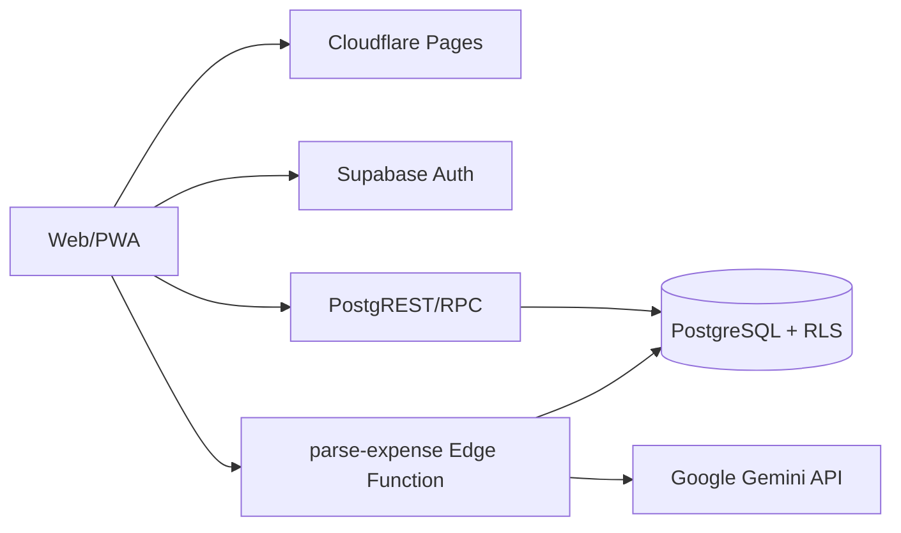

# Family Expense — Project Handoff

> Cập nhật: **31/08/2026** (`Asia/Ho_Chi_Minh`)
> Trạng thái: **Production đang hoạt động; tài liệu này là ngữ cảnh kỹ thuật cho các phiên làm việc tiếp theo**  
> Production: <https://family-expense-8fo.pages.dev>

## Trạng thái dự án

- [x] Ứng dụng production đang chạy trên Cloudflare Pages.
- [x] Mã nguồn frontend, Supabase migrations/RLS/RPC và Edge Function có trong workspace.
- [x] README, CHANGELOG và SAD đã được cập nhật.
- [x] Git remote, protected `main`, CI/CD và Cloudflare Pages Git deployment đã thiết lập.
- [x] Supabase production workflow đã kiểm tra thành công bằng `workflow_dispatch` với `dry_run=true`; không thay đổi database hoặc deploy Edge Function.
- [x] Supabase staging tách biệt đã thiết lập.
- [ ] Thực hiện backup/restore và rollback drill.

## Handoff mới nhất — release 31/08/2026

- PR #58 đã merge vào `main` với merge commit `55d4fdab617fd03e2203249eee5180180b5587b0`; Cloudflare Pages production đã deploy thành công và production smoke test trả HTTP 200.
- UI đã đổi bộ chọn giao diện/ngôn ngữ thành switch; giao diện chỉ còn Sáng/Tối, lựa chọn `system` cũ được quy về Sáng. Dashboard có keyboard accessibility cho chart và báo lỗi từng nhóm dữ liệu.
- Migration `supabase/migrations/202608310001_dashboard_summary_six_months.sql` đang chờ deploy production qua Supabase workflow; migration cập nhật RPC `get_dashboard_summary` để trả đủ 6 tháng xu hướng.
- CI quality, `db-security`, preview và Cloudflare checks của PR #58 đều pass; local test 61/61, lint, typecheck và build pass.

- Production đã nhận merge commit `54983d914f83c7ff8ccb5cfed2c3d22020cdfcaf` qua PR #57; trước đó PR #55 và #56 đã hoàn tất bộ lọc EN và đồng bộ selector.
- Cloudflare Pages production deployment của merge commit đã thành công; URL production trả HTTP 200. Release không thay đổi database, enum nghiệp vụ, sheet hoặc tên cột Excel.
- UI hiện hỗ trợ VI/EN cho các nhãn chính, bộ lọc tháng/năm hiển thị tên tháng tiếng Anh, hai selector Appearance/Language dùng chung độ rộng, và nút export dùng wording `Download Excel file`.
- Dashboard hiện đặt `Income by purpose` bên trái và `Expenses by purpose` bên phải; đã bỏ nút `View transactions` dư, còn click trực tiếp vào lát/cột biểu đồ vẫn mở danh sách theo bộ lọc.
- CI quality và `db-security` trên merge commit đều đạt; local validation gần nhất đạt 61/61 tests, lint, typecheck và build. Build vẫn có cảnh báo chunk ExcelJS lớn hiện hữu.
- Tên danh mục/giao dịch do người dùng nhập có thể vẫn là tiếng Việt khi dùng EN theo chủ ý bảo toàn dữ liệu; nhãn giao diện được dịch riêng ở frontend.
- Working tree tại thời điểm cập nhật vẫn có thay đổi chưa commit trên `CHANGELOG.md`, `vite.config.ts` và file tạm `.pnpm-store/*`; các thay đổi này không thuộc release PR #57 và không bị ghi đè.

## 1. Project Overview

| Hạng mục | Nội dung |
|---|---|
| Mục tiêu | Thay Excel bằng ứng dụng quản lý giao dịch gia đình tiếng Việt, đa thành viên, mobile-first/PWA và hỗ trợ AI gợi ý nhập liệu. |
| Phạm vi đã có | Auth, family/member, giao dịch, dashboard, danh mục, import/export, AI suggestion, bulk edit/delete, thùng rác và PWA. |
| Ngoài MVP | OCR, đồng bộ ngân hàng, kế toán doanh nghiệp, phê duyệt nhiều cấp và lưu chứng từ bằng Storage. |
| Trạng thái | Go-live/đang chạy; cần hardening delivery và vận hành. |
| Dữ liệu nguồn | Excel đã đối chiếu 2.090 giao dịch, tổng ròng 1.696.313.649 VND. |

## 2. Architecture Summary



- Frontend: React 19, TypeScript strict, Vite, React Router, Tailwind CSS, TanStack Query, React Hook Form, Zod, Recharts và vite-plugin-pwa.
- Backend: Supabase Auth, PostgreSQL, RLS, RPC và Edge Functions.
- Hosting: Cloudflare Pages.
- AI: `parse-expense` gọi Gemini bằng secret server-side, validate structured output và chỉ trả đề xuất; người dùng phải xác nhận trước khi lưu.
- Tenant boundary: mọi dữ liệu nghiệp vụ được scope theo `family_id`; RLS là lớp phân quyền bắt buộc.
- Chi tiết: [Solution Architecture Document](docs/Solution_Architecture_Document_Family_Expense.docx).

## 4. Codebase & Repositories

| Vị trí | Nội dung |
|---|---|
| `src/pages/` | Các màn hình và page tests |
| `src/components/` | Layout, feedback, loading/empty states và UI dùng chung |
| `src/context/` | App/session state và theme |
| `src/lib/` | Domain, Supabase client/API, AI và import/export |
| `supabase/migrations/` | Schema, RLS, RPC, indexes và migration dữ liệu |
| `supabase/functions/parse-expense/` | Edge Function tích hợp Gemini |
| `scripts/` | Import Excel và các script hỗ trợ vận hành |
| `docs/` | SAD và runbook deploy/vận hành |
| `README.md` | Cài đặt, cấu hình và triển khai |
| `CHANGELOG.md` | Nguồn cập nhật mới nhất của dự án |

### Repository và branching

- Git remote: `https://github.com/nhan0805/family-expense.git`.
- Repository private, `main` được bảo vệ, feature branch + pull request.
- Bắt buộc review và CI xanh trước khi merge/deploy production.
- Không commit `.env`, `node_modules`, secret hoặc Supabase temporary files.

## 5. Environment & Infrastructure

| Môi trường | Frontend | Backend | Trạng thái |
|---|---|---|---|
| Local | `http://127.0.0.1:5173` | Supabase local hoặc configured project | Có |
| Preview | Cloudflare Pages deployment URL | Không dùng production để test mutation | Có theo deployment |
| Staging | Cloudflare preview/local | Supabase project riêng `gkvhztqoaslarykxxelt` với dữ liệu test | Đang sử dụng |
| Production | `https://family-expense-8fo.pages.dev` | Supabase Cloud linked project | Đang chạy |

Thông tin project ID, account ID và quyền truy cập phải được lưu trong password manager/CMDB của đội, không ghi key vào file này.

## 6. Deployment & CI/CD

### Quality gates

```bash
pnpm lint
pnpm typecheck
pnpm test
pnpm build
pnpm test:e2e
```

### Quy trình hiện tại

1. Đọc mục mới nhất trong `CHANGELOG.md`.
2. Chạy lint, typecheck, test phù hợp và production build.
3. Nếu có database change, thêm migration timestamp mới; không sửa migration đã áp dụng.
4. Với thay đổi database/function, mở PR vào `main` và chờ CI/preview checks.
5. Supabase production deploy chạy qua `.github/workflows/supabase-deploy.yml` sau khi thay đổi migration/function được merge vào `main`.
6. Có thể chạy thủ công với `dry_run=true` để kiểm tra credential, project link và migration mà không ghi production; `dry_run=false` mới áp dụng migration/deploy function.
7. Cloudflare Pages production deploy qua Git integration từ `main`; không dùng `wrangler pages deploy` cho production.
8. Smoke test đăng nhập, tải danh sách, tạo/sửa giao dịch, import/export và AI.
9. Cập nhật `CHANGELOG.md` với kết quả kiểm thử và deployment URL.

> **Đã xác nhận gần nhất:** PR #31, merge commit `4682364870797aeb6b5b29e4bbe3bd61f2e97e09`. CI quality/db-security và Cloudflare Pages production check đã pass; Supabase Production Deploy không có migration mới cần áp dụng.

### Rollback

1. Frontend: rollback/promote Cloudflare Pages deployment ổn định gần nhất.
2. Edge Function: redeploy artifact/commit trước đã kiểm thử.
3. Database: ưu tiên forward-fix bằng migration mới; không xóa hoặc sửa migration production cũ.
4. Với sự cố dữ liệu, kích hoạt restore theo chính sách backup/PITR của Supabase.
5. Sau rollback, chạy smoke test và ghi incident timeline.

## 7. Configuration & Secrets

| Tên | Nơi sử dụng | Nơi lưu đúng |
|---|---|---|
| `VITE_SUPABASE_URL` | Frontend | Cloudflare environment / `.env.local` |
| `VITE_SUPABASE_ANON_KEY` | Frontend | Cloudflare environment / `.env.local` |
| `GEMINI_API_KEY` | Edge Function | Supabase Secret |
| `GEMINI_MODEL` | Edge Function | Supabase Secret/config |
| `SUPABASE_URL` | Edge Function | Supabase Secret |
| `SUPABASE_ANON_KEY` | Edge Function | Supabase Secret |
| Cloudflare API token | CI/deploy | CI environment secret |
| Supabase access token | Migration/deploy | CI environment secret |

### Rotation SOP

1. Tạo credential mới với scope tối thiểu.
2. Cập nhật và kiểm tra trên staging trước.
3. Cập nhật production và smoke test.
4. Thu hồi credential cũ khi không còn request sử dụng.
5. Ghi ngày rotation và owner, không ghi giá trị secret.

## 8. Third-party Integrations

| Dịch vụ | Mục đích | Cần theo dõi |
|---|---|---|
| Supabase Cloud | Auth, PostgreSQL, RLS, RPC, Edge Function và GitHub deploy workflow | Quota, backup/PITR, egress, email rate limit |
| Cloudflare Pages | Hosting, CDN, PWA deployment | Build quota, domain và API token |
| Google AI Studio/Gemini | Structured AI suggestion | Quota/429, privacy policy và model lifecycle |
| npm ecosystem | Runtime/build dependencies | License, vulnerability và deprecation |

Plan, billing owner và renewal date: **TBD — xác minh trong tài khoản nhà cung cấp**.

## 9. Database & Data

| Nhóm | Đối tượng chính | Ghi chú |
|---|---|---|
| Tenant/Auth | `families`, `family_members` | Membership active, role owner/member |
| Phân loại | `purposes`, `expense_types`, `payment_methods`, `accounts`, `events`, `beneficiaries` | Không hard-delete danh mục đã được dùng |
| Giao dịch | `transactions` | `amount > 0`, soft delete bằng `deleted_at`, lưu nguồn/audit AI |
| Kế hoạch | `budgets`, `recurring_transactions` | Schema có sẵn; UI nâng cao ngoài MVP |
| AI audit | `ai_usage_logs` | Chỉ metadata tối thiểu, không token/API key |
| Import | `import_batches` và RPC liên quan | Atomic batch, chống trùng và audit |

### Lưu ý tương thích dữ liệu

- UI dùng nhãn **Tiền ra/Tiền vào**, database vẫn giữ enum cũ **Chi tiêu/Thu nhập** để tương thích.
- Dữ liệu **Hoàn tiền/Tạm ứng** cũ vẫn được đọc và báo cáo; form mới không tạo hai loại này.
- UI dùng nhãn **Mục đích/Danh mục**, tên bảng vẫn là `purposes/expense_types`.

### Backup, restore và retention

- [ ] Xác minh backup/PITR và retention theo Supabase plan.
- [ ] Restore drill sang project không-production tối thiểu hàng quý.
- [x] Xóa thông thường là soft delete và có màn hình Đã xóa/khôi phục.
- [ ] Chốt retention cho thùng rác và `ai_usage_logs`.
- [ ] Cân nhắc export định kỳ ngoài nhà cung cấp theo RPO.

Mục tiêu kiến trúc đề xuất cho MVP: **RPO 24 giờ, RTO 4 giờ**; chưa được coi là đạt cho đến khi restore drill thành công.

## 10. Monitoring, Logging & Alerting

| Nguồn | Theo dõi | Owner | Trạng thái |
|---|---|---|---|
| Cloudflare | Build/deploy, availability, Web Vitals | TBD | Cần cấu hình alert |
| Supabase | Auth, DB, slow query, Edge Function errors | TBD | Có log nền tảng |
| `ai_usage_logs` | Success/error, latency, rate limit | TBD | Có dữ liệu cơ bản |
| Client/PWA | JS errors, offline, JWT refresh failure | TBD | Chưa có error tracking chuẩn |
| Synthetic | Login/health/smoke URL | TBD | Chưa có |

Không log token, secret, email đầy đủ, nội dung AI hoặc chi tiết tài chính.

## 11. Known Issues & Technical Debt

| Ưu tiên | Vấn đề | Workaround hiện tại |
|---|---|---|
| P0 | Git/CI/CD/staging đã chuẩn hóa; cần duy trì quy trình release | Theo dõi CI, preview, staging rehearsal và Cloudflare Git deployment |
| P1 | JWT `issued at future` trên mobile/PWA | Refresh session khi foreground; đăng nhập lại nếu cần; bật giờ tự động |
| P1 | Supabase email rate limit | Không gửi lặp; chờ quota hoặc cấu hình SMTP custom |
| P1 | Gemini Free Tier/429/model thay đổi | Không retry vô hạn; nhập thủ công; model qua environment variable |
| P1 | Monitoring chưa đầy đủ | Kiểm tra platform logs thủ công |
| P2 | Nhãn nghiệp vụ UI khác enum database | Mapping tương thích, bảo toàn dữ liệu legacy |
| P3 | Storage chưa sử dụng | Ngoài MVP |

## 12. Runbooks / SOPs

### Không đăng nhập hoặc reset password được

1. Kiểm tra Supabase Auth status và redirect URL của domain hiện tại.
2. Phân biệt `invalid credentials`, email rate limit và JWT/clock skew.
3. Nếu rate limit: dừng gửi lặp và kiểm tra SMTP/quota.
4. Nếu reset redirect về login: kiểm tra route `/dat-lai-mat-khau`, Site URL và Redirect URLs.
5. Không yêu cầu người dùng gửi access token/JWT.

### JWT `issued-at-future` trên PWA

1. Bật ngày/giờ tự động trên thiết bị.
2. Đưa app ra foreground để session tự refresh và thử lại một lần.
3. Nếu còn lỗi: đăng xuất/đăng nhập lại; kiểm tra service worker/version mới.
4. Đối chiếu Supabase Auth logs theo timestamp, không log JWT.

### Gemini trả 429 hoặc JSON không hợp lệ

1. Kiểm tra `ai_usage_logs` và Edge Function logs.
2. Không retry liên tục khi 429; cho phép người dùng nhập thủ công.
3. Kiểm tra `GEMINI_MODEL`, quota, JSON Schema và danh mục family.
4. Không gọi Gemini trực tiếp từ frontend và không bỏ server validation.

### Nghi ngờ truy cập chéo family

1. Xếp sự cố security P1 và tạm dừng mutation/deploy liên quan nếu cần.
2. Bảo toàn log metadata; không sao chép dữ liệu tài chính vào chat/ticket.
3. Kiểm tra RLS, RPC `SECURITY DEFINER`, `auth.uid()` và `family_id`.
4. Sửa bằng migration mới và chạy negative security tests.
5. Đánh giá phạm vi ảnh hưởng và thông báo theo quy trình privacy/security.

## 13. Testing & QA

| Loại | Lệnh | Trạng thái trước deploy |
|---|---|---|
| Lint | `pnpm lint` | Bắt buộc |
| TypeScript | `pnpm typecheck` | Bắt buộc |
| Unit/RTL | `pnpm test` | Bắt buộc |
| Production build/PWA | `pnpm build` | Bắt buộc |
| E2E | `pnpm test:e2e` | Staging/release |
| DB/RLS | Supabase local/staging tests | Đã thêm pgTAP policy/constraint job vào CI; staging drill theo runbook |

Không ghi tài khoản test trong file. Tạo user/family riêng ở staging và lưu credential trong password manager của đội.

## 14. Documentation Index

| Tài liệu | Vị trí | Trạng thái |
|---|---|---|
| Solution Architecture Document | [`docs/Solution_Architecture_Document_Family_Expense.docx`](docs/Solution_Architecture_Document_Family_Expense.docx) | Hoàn thành |
| Project Handoff bản Markdown | `HANDOFF.md` | Tài liệu mới nhất |
| Setup/deploy guide | [`README.md`](README.md) | Có; cập nhật khi pipeline đổi |
| Change history | [`CHANGELOG.md`](CHANGELOG.md) | Nguồn cập nhật mới nhất |
| Database contract | `supabase/migrations/*.sql` | Nguồn sự thật kỹ thuật |
| AI contract | `supabase/functions/parse-expense/index.ts` | Nguồn sự thật kỹ thuật |

## 15. Outstanding Tasks & Roadmap

| Ưu tiên | Việc | Owner | Due | Trạng thái |
|---|---|---|---|---|
| P0 | Git remote, baseline tag và protected `main` | Chủ dự án | Đã thực hiện | Hoàn thành |
| P0 | CI lint/typecheck/test/build + Cloudflare preview | Chủ dự án | Đã thực hiện | Hoàn thành |
| P0 | Supabase/Cloudflare staging tách biệt | Chủ dự án | Đã thực hiện | Hoàn thành |
- P0 | Supabase deploy workflow với dry-run và Git-based production path | Chủ dự án | 29/08/2026 | Hoàn thành; dry-run đã pass |
| P1 | RLS negative tests và migration rehearsal | Chủ dự án | Mỗi release DB | Structural pgTAP policy/constraint test đã pass trong CI; fixture cross-family vẫn cần dữ liệu test staging |
| P1 | Monitoring/alert/error tracking không chứa PII | TBD | TBD | Chưa làm |
| P1 | Backup restore và rollback drill | TBD | Mỗi quý | Đã có script/runbook an toàn; drill staging thực tế chờ `STAGING_DB_URL` và `RESTORE_DB_URL` |
| P1 | Chốt retention/log/privacy policy | TBD | TBD | Cần quyết định |
| P2 | Đánh giá migration enum Tiền vào/Tiền ra dài hạn | TBD | TBD | Theo dõi |
| P3 | Storage chứng từ/recurring/queue khi có business case | TBD | TBD | Backlog |

---

**Nguyên tắc duy trì:** trước mọi thay đổi, đọc mục mới nhất trong `CHANGELOG.md`; sau thay đổi, cập nhật `CHANGELOG.md` với trước/sau, file hoặc DB object, kiểm thử và trạng thái triển khai.
