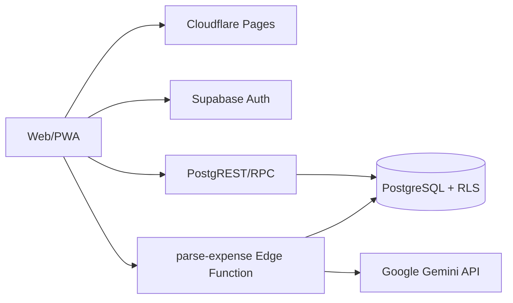

# Family Expense — Project Handoff

> Cập nhật: **02/09/2026** (`Asia/Ho_Chi_Minh`)
> Trạng thái: **Production đang hoạt động; tài liệu này là ngữ cảnh kỹ thuật cho các phiên làm việc tiếp theo**  
> Production: <https://family-expense-8fo.pages.dev>

## Trạng thái dự án

- [x] Ứng dụng production đang chạy trên Cloudflare Pages.
- [x] Mã nguồn frontend, Supabase migrations/RLS/RPC và Edge Function có trong workspace.
- [x] README, CHANGELOG và SAD đã được cập nhật.
- [x] Git remote, protected `main`, CI/CD và Cloudflare Pages Git deployment đã thiết lập.
- [x] Supabase production workflow đã kiểm tra thành công bằng `workflow_dispatch` với `dry_run=true`; không thay đổi database hoặc deploy Edge Function.
- [x] Supabase staging tách biệt đã thiết lập.
- [ ] Thực hiện backup/restore và rollback drill.

### Handoff — đồng bộ accent Dracula cho giao dịch, KPI và công cụ dữ liệu (01/09/2026)

- Chi tiêu dùng Dracula Pink `#FF79C6`, Thu nhập dùng Dracula Green `#50FA7B`; nền dòng nhẹ hơn, số tiền/badge vẫn rõ. Kicker dùng Purple `#BD93F9`, icon dùng Green/Cyan, KPI và nút chọn kỳ được đồng bộ accent trong dark mode.
- Files chính: `src/components/TransactionRow.tsx`, `src/pages/Dashboard.tsx`, `src/pages/ImportExport.tsx`; regression assertions trong `src/pages/Transactions.test.ts`, `src/pages/Dashboard.test.tsx`, `src/pages/ImportExport.test.tsx`. Hoàn tiền và Tạm ứng giữ nguyên.
- Không thay đổi API, schema, migration, RLS/RPC, dữ liệu hoặc quy tắc nghiệp vụ trong phần visual này.
- Trạng thái triển khai dự kiến: Chờ quality checks, commit/push branch, PR vào `main`, required checks và Cloudflare Pages Git integration.

### Handoff — loại bỏ Hoàn tiền và Tạm ứng (02/09/2026)

- Hệ thống hiện chỉ còn hai loại giao dịch: `Chi tiêu` và `Thu nhập`; form, validation, Dashboard, danh sách, import/export và Edge Function không còn tạo hoặc xử lý `Hoàn tiền`/`Tạm ứng`. Dark mode đồng bộ accent Dracula cho dòng giao dịch, KPI, icon/title Data và nút chọn kỳ.
- Migration `supabase/migrations/202609010004_remove_legacy_transaction_kinds.sql` thay `transaction_kind` bằng enum hai giá trị. Nếu database còn dữ liệu legacy, migration chuẩn hóa `Hoàn tiền → Thu nhập` và `Tạm ứng → Chi tiêu` trước khi xóa giá trị cũ; migration cũ không bị sửa.
- RPC `get_dashboard_summary`, `get_dashboard_trends` và `list_family_transactions` đã được cập nhật để dùng công thức `Chi tiêu − Thu nhập`; dữ liệu sau migration không còn phụ thuộc loại legacy.
- Files chính: `src/lib/domain.ts`, `src/pages/Dashboard.tsx`, `src/pages/Transactions.tsx`, `src/components/TransactionRow.tsx`, `src/lib/importExcel.ts`, `supabase/functions/summarize-dashboard/index.ts`; test domain/Dashboard/Transactions/import Excel đã cập nhật.
- Validation local: `pnpm test` 19/19 file, 83/83 test; `pnpm lint`, `pnpm typecheck`, `pnpm build` và `git diff --check` pass. E2E chưa chạy được vì thiếu Playwright browser binaries; Supabase local chưa chạy vì thiếu container.
- Trạng thái triển khai dự kiến: Chờ commit/push branch, PR vào `main`, required checks, Supabase Production Deploy và Cloudflare Pages Git integration.

### Handoff — tên danh mục tiếng Anh theo ngôn ngữ giao diện (01/09/2026)

- Catalog item có thêm `nameEn` tùy chọn, map từ cột Supabase `name_en`; dữ liệu tiếng Việt và ID hiện có vẫn là canonical, nên không ảnh hưởng giao dịch đã lưu.
- Danh mục mặc định được seed/backfill bản dịch tiếng Anh. Danh mục tự tạo có thể nhập tên tiếng Anh trong form Catalogs; để trống sẽ fallback về tên tiếng Việt khi giao diện dùng English.
- Các màn hình đã dùng helper chung: Catalogs, form giao dịch, bộ lọc/bảng giao dịch, Dashboard charts/breakdown, template Excel và export Excel. Import chấp nhận cả tên tiếng Việt lẫn tiếng Anh.
- Migration mới: `supabase/migrations/202609010003_bilingual_catalog_names.sql`; migration cũng mở rộng Dashboard summary RPC để trả `nameEn`.
- Validation local: `pnpm test` 19/19 file, 82/82 test; `pnpm lint`, `pnpm typecheck`, `pnpm build` và `git diff --check` pass. Build còn cảnh báo chunk lớn/dynamic import ExcelJS.
- Trạng thái triển khai dự kiến: Chờ commit/push, PR vào `main`, Supabase production workflow và Cloudflare Pages Git integration sau khi merge.

### Handoff — thử nghiệm bảng màu Dracula Official cho dark mode (01/09/2026)

- Dark mode đã chuyển từ nền xanh đậm sang bảng màu Dracula: nền `#282A36`, surface `#343746`/`#44475A`, chữ `#F8F8F2`, accent tím `#BD93F9`, hồng `#FF79C6` và cyan `#8BE9FD`; light mode và layout vẫn giữ nguyên.
- Đã đồng bộ token, focus state, navigation, button, chip, avatar, empty state, toast/dialog, menu giao dịch, tooltip dashboard, bulk-edit modal và các màn hình đăng nhập/tạo gia đình.
- Files chính: `src/index.css`, `src/context/ThemeContext.tsx`, `src/components/ThemeSelect.tsx`, `src/components/AsyncStates.tsx`, `src/components/Feedback.tsx`, `src/components/TransactionRow.tsx`, `src/pages/Dashboard.tsx`, `src/pages/Transactions.tsx`, `src/pages/ImportExport.tsx`, `src/pages/Login.tsx`, `src/pages/ResetPassword.tsx`, `src/pages/CreateFamily.tsx`.
- Không thay đổi API, schema, migration, RLS/RPC, dữ liệu hoặc quy tắc nghiệp vụ.
- Validation local: `pnpm test` 19/19 file, 80/80 test; `pnpm lint`, `pnpm typecheck`, `pnpm build` và `git diff --check` pass. Build còn cảnh báo chunk lớn/dynamic import ExcelJS đã có từ trước.
- Trạng thái triển khai: Đã merge PR #96 vào `main` với merge commit `4c9ae945a12d2d33c0796a45a5854d6a08fe9116`; CI main [33531570638](https://github.com/nhan0805/family-expense/actions/runs/33531570638), quality/db-security và Cloudflare Preview đều pass. Cloudflare Pages production đang phục vụ đúng asset CSS `assets/index-CkRfJRC_.css`; smoke test `https://family-expense-8fo.pages.dev/` trả HTTP 200 lúc `01/09/2026 23:26` (`Asia/Ho_Chi_Minh`). Không tạo deploy lần hai chỉ để cập nhật tài liệu.

### Handoff — giảm độ gắt màu giao dịch trong Dracula dark mode (01/09/2026)

- Chi tiêu dùng Dracula Pink `#FF79C6`, Thu nhập dùng Dracula Green `#50FA7B`; nền dòng chỉ còn tint nhẹ, còn số tiền và badge giữ accent rõ. Hoàn tiền và Tạm ứng giữ nguyên tone hiện tại.
- Cập nhật tone trong `src/components/TransactionRow.tsx` và `src/pages/Transactions.tsx`; bổ sung assertion trong `src/pages/Transactions.test.ts`. Không thay đổi API, schema, migration, RLS/RPC, dữ liệu hoặc quy tắc nghiệp vụ.
- Validation local: test giao dịch liên quan, `pnpm lint`, `pnpm typecheck`, `pnpm build` và `git diff --check` pass. Full suite trong working tree còn 2 test Catalogs liên quan nhóm thay đổi song ngữ đang chờ deploy, không thuộc release màu này.
- Trạng thái triển khai dự kiến: Chưa deploy; sẽ deploy qua GitHub PR vào `main` và Cloudflare Pages Git integration sau khi required checks pass.

### Handoff — tăng tương phản avatar chữ cái trong danh sách thành viên (01/09/2026)

- Avatar chữ cái cạnh tên thành viên trong dark mode đã dùng màu chữ sáng hơn, nền xanh rõ hơn và viền tương phản hơn; không thay đổi layout, dữ liệu hoặc quyền thành viên.
- Cập nhật rule `.dark .member-avatar` trong `src/index.css`; regression test trong `src/pages/Members.test.tsx` xác nhận avatar được render đúng.
- Không thay đổi API, schema, migration, RLS/RPC hoặc quy tắc nghiệp vụ.
- Validation local: `pnpm test` 19/19 file, 80/80 test; `pnpm lint`, `pnpm typecheck`, `pnpm build` và `git diff --check` pass. `pnpm test:e2e` bị sandbox chặn quyền bind `127.0.0.1:5173`; không cài thêm dependency. Build còn cảnh báo chunk lớn/dynamic import ExcelJS đã có từ trước.
- Trạng thái triển khai: Đã merge PR #95 vào `main` với merge commit `ec0c1427f1e6d9ee33d02666433149b1927731ba`; CI main quality/db-security pass. Cloudflare Pages production qua Git integration đã phục vụ build mới và production smoke test trả HTTP 200 lúc `01/09/2026 23:08` (`Asia/Ho_Chi_Minh`). Không tạo deploy lần hai chỉ để cập nhật tài liệu.

### Handoff — đưa nút sao chép/xóa của từng dòng giao dịch lại gần số tiền (01/09/2026)

- Bảng giao dịch desktop đã gộp vùng thao tác vào cùng cột với số tiền, nên nút sao chép/xóa nằm ngay cạnh số tiền thay vì bị đẩy thành cột cuối xa bên phải.
- Bảng dùng `w-full` với chiều rộng tối thiểu `940px`; các ô mô tả, mục đích, danh mục và phương thức thanh toán dùng `min-w-0 truncate` để nội dung dài không làm nở bảng.
- Files chính: `src/components/TransactionRow.tsx`, `src/pages/Transactions.tsx`; regression test: `src/components/TransactionRow.test.tsx`.
- Không thay đổi API, schema, migration, RLS/RPC, dữ liệu hoặc quy tắc nghiệp vụ.
- Validation local: `pnpm test` 19/19 file, 79/79 test; `pnpm lint`, `pnpm typecheck`, `pnpm build` và `git diff --check` pass. `pnpm test:e2e` bị sandbox chặn quyền bind `127.0.0.1:5173`; không cài thêm dependency. Build còn cảnh báo chunk lớn/dynamic import ExcelJS đã có từ trước.
- Trạng thái triển khai: Đã merge PR #95 vào `main` với merge commit `ec0c1427f1e6d9ee33d02666433149b1927731ba`; CI main quality/db-security pass. Cloudflare Pages production qua Git integration đã phục vụ build mới và production smoke test trả HTTP 200 lúc `01/09/2026 23:08` (`Asia/Ho_Chi_Minh`). Không tạo deploy lần hai chỉ để cập nhật tài liệu.

### Handoff — UI đợt 1: visual polish Dashboard, Layout và giao dịch (01/09/2026)

- Đã chuẩn hóa visual token trong `src/index.css`: màu nền/bề mặt, border, shadow, radius, typography, button, field, focus state và motion-reduction.
- App shell có header với brand mark, sidebar active state có accent, mobile menu có scrim, bottom navigation dạng glass nhẹ và FAB thêm giao dịch nhất quán hơn.
- Dashboard được polish hierarchy cho page heading, bộ chọn kỳ, KPI, chart/breakdown/insight card và trạng thái lỗi; giữ nguyên công thức, filter link và dữ liệu.
- Transactions được polish heading, net summary, filter panel/chips, list toolbar/table container; transaction card/table row nhận transition và border state nhất quán hơn.
- Files chính: `src/index.css`, `src/components/Layout.tsx`, `src/components/TransactionRow.tsx`, `src/pages/Dashboard.tsx`, `src/pages/Transactions.tsx`; tests: `src/pages/Dashboard.test.tsx`, `src/pages/Transactions.ui.test.tsx`.
- Không thay đổi API, schema, migration, RLS/RPC hay quy tắc nghiệp vụ.
- Validation local: `pnpm test` 19/19 file, 78/78 test; `pnpm lint`, `pnpm typecheck`, `pnpm build` và `git diff --check` pass. Build còn cảnh báo chunk lớn/dynamic import ExcelJS đã có từ trước.
- E2E smoke local chưa chạy được vì Playwright thiếu browser binaries (`chromium`/`webkit`); không cài thêm dependency trong phiên này. CI main đã chạy quality và db-security thành công.
- Trạng thái triển khai: Đã merge PR #92 vào `main` với merge commit `d827acb17aa29c68e623f1480ea7b628e0cf78e7`; Cloudflare Pages production deployment đã pass và production smoke test `https://family-expense-8fo.pages.dev/` trả HTTP 200 lúc `01/09/2026 21:32` (`Asia/Ho_Chi_Minh`). Không có migration/database change trong release UI này.

### Handoff — UI đợt 2: form giao dịch, danh mục, thành viên và dữ liệu (01/09/2026)

- Đã chuẩn hóa form giao dịch với page hierarchy, section heading, hint bắt buộc, panel AI, disclosure tùy chọn nâng cao, feedback state và action bar; giữ nguyên validate, draft, AI suggestion, voice input và soft-delete.
- Đã polish `Catalogs`, `Members` và `ImportExport`: card/list header, row hover, icon touch target, avatar chữ cái, danger zone, upload zone, stat card và bảng preview responsive.
- Files chính: `src/index.css`, `src/pages/TransactionForm.tsx`, `src/pages/Catalogs.tsx`, `src/pages/Members.tsx`, `src/pages/ImportExport.tsx`; tests: `src/pages/TransactionForm.test.tsx`, `src/pages/Catalogs.test.tsx`, `src/pages/Members.test.tsx`, `src/pages/ImportExport.test.tsx`.
- Không thay đổi API, schema, migration, RLS/RPC, dữ liệu production hoặc quy tắc nghiệp vụ.
- Validation local: `pnpm test` 19/19 file, 78/78 test; `pnpm lint`, `pnpm typecheck`, `pnpm build` và `git diff --check` pass. E2E local bị chặn vì thiếu Playwright browser binaries (`chromium`/`webkit`).
- Trạng thái triển khai: Đã merge PR #93 vào `main` với merge commit `f8dbd2e55580c7530b7413126c6eef8a972971dd`; CI main và Cloudflare Pages production deployment đều pass. Production smoke test `https://family-expense-8fo.pages.dev/` trả HTTP 200 lúc `01/09/2026 21:50` (`Asia/Ho_Chi_Minh`). Không có migration/database change trong release này.

### Handoff — sửa tương phản dark mode và cân đối card dữ liệu (01/09/2026)

- Dark mode đã được tăng tương phản cho token nền/bề mặt/border/text, placeholder, focus state, page kicker, navigation active state và chip bộ lọc; riêng icon tìm kiếm trên màn hình giao dịch được làm rõ hơn.
- Ba card `Tải template`, `Xuất dữ liệu`, `Gửi qua email` dùng cùng chiều cao trên grid desktop/tablet; phần hành động neo ở đáy để nút thẳng hàng dù mô tả dài ngắn khác nhau.
- Files chính: `src/index.css`, `src/pages/Transactions.tsx`, `src/pages/ImportExport.tsx`; test: `src/pages/ImportExport.test.tsx`. Không thay đổi API, schema, migration, RLS/RPC hay quy tắc nghiệp vụ.
- Validation local: `pnpm test` 19/19 file, 78/78 test; `pnpm lint`, `pnpm typecheck`, `pnpm build` và `git diff --check` pass. E2E local chưa chạy vì thiếu Playwright browser binaries.
- Trạng thái triển khai: Đã merge PR #94 vào `main` với merge commit `76bd413e6a033eef10d1590d4ba7254ad2338066`; CI main và Cloudflare Pages production deployment đều pass. Production smoke test `https://family-expense-8fo.pages.dev/` trả HTTP 200 lúc `01/09/2026 22:23` (`Asia/Ho_Chi_Minh`). Không có migration/database change trong release này.

### Handoff — cân đối bộ lọc chi tiết trên web (01/09/2026)

- Bộ lọc chi tiết được sắp xếp thành 4 cột trên desktop, 3 cột trên tablet và 1 cột trên mobile; 12 mục lọc tạo thành các hàng đầy đủ, không còn hàng cuối bị lẻ.
- Khoảng cách giữa các trường được thống nhất bằng grid gap `0.75rem`; không đổi thứ tự, giá trị, validation hoặc logic lọc.
- Regression UI kiểm tra các breakpoint class `md:grid-cols-3`, `xl:grid-cols-4` và đảm bảo bỏ layout 5 cột cũ.
- Validation local: `pnpm test` 19/19 file, 77/77 test; `pnpm lint`, `pnpm typecheck`, `pnpm build` và `git diff --check` pass. Build chỉ còn các cảnh báo chunk lớn/dynamic import ExcelJS đã có từ trước.
- Không thay đổi API, schema hoặc database. PR #88 đã merge vào `main` với merge commit `d24572ad52e98961ba0f374771d2d39213a2af0c`; `quality`, `db-security`, Supabase Preview và Cloudflare Pages đều pass.
- Production smoke test: `https://family-expense-8fo.pages.dev/` trả HTTP 200 lúc `01/09/2026 08:18` (`Asia/Ho_Chi_Minh`).

### Handoff — ẩn ID kỹ thuật trong thông báo bộ lọc AI (01/09/2026)

- Thông báo giải thích sau khi AI áp dụng bộ lọc đã loại bỏ UUID kỹ thuật; các ID nội bộ vẫn được giữ để áp dụng bộ lọc.
- Cập nhật `src/pages/Transactions.tsx` và regression test trong `src/pages/Transactions.ui.test.tsx`; không thay đổi API, schema hoặc database.
- Validation local: `pnpm test` 19/19 file, 78/78 test, `pnpm lint`, `pnpm typecheck`, `pnpm build` và `git diff --check` pass. Build còn cảnh báo chunk lớn/dynamic import ExcelJS đã có từ trước.
- Trạng thái triển khai: Đã merge PR #89 vào `main` với merge commit `7bbcd87fc7dc4f42828de14f07d0a7186bc15134`; `quality`, `db-security`, Cloudflare Preview và Cloudflare Pages đều pass. Production smoke test trả HTTP 200 lúc `01/09/2026 08:52` (`Asia/Ho_Chi_Minh`).

### Handoff — sửa lỗi Hủy bản nháp giao dịch (01/09/2026)

- Nút `Hủy` trong form thêm giao dịch trước đây chỉ điều hướng bằng `nav(-1)`, không xóa bản nháp đã lưu trên thiết bị.
- Đã bổ sung handler xóa draft theo `family_id` trước khi điều hướng; khi sửa giao dịch có `id`, thao tác Hủy không xóa draft của luồng thêm giao dịch.
- Regression test kiểm tra bản nháp được khôi phục rồi biến mất sau khi nhấn `Hủy`.
- Validation local: `pnpm test` 19/19 file, 77/77 test; `pnpm lint`, `pnpm typecheck`, `pnpm build` và `git diff --check` pass. Build chỉ còn các cảnh báo chunk lớn/dynamic import ExcelJS đã có từ trước.
- Không thay đổi API, schema hoặc database. PR #87 đã merge vào `main` với merge commit `980bfe7ce4c999043d96ecdefe55f15c52e61d82`; `quality`, `db-security`, Preview và Cloudflare Pages đều pass.
- Production smoke test: `https://family-expense-8fo.pages.dev/` trả HTTP 200 lúc `01/09/2026 01:07` (`Asia/Ho_Chi_Minh`). Không tạo deploy thứ hai chỉ để cập nhật handoff.


### Handoff phiên làm việc — KPI mobile và bộ lọc giao dịch (01/09/2026)

- PR #85 đã merge vào `main` với merge commit `84f6021a8b6bd607324a8501a5aadbf452aa5223`.
- Dashboard sửa lỗi KPI `Giá trị ròng` bị lệch lớp trên mobile bằng link dạng block/full-height và wrapper grid `min-w-0`.
- Bộ lọc giao dịch được thu gọn; input `Từ số tiền`/`Đến số tiền` bỏ placeholder, hiển thị phân cách hàng nghìn VND, chỉ nhận chữ số và dùng cỡ chữ 16px để tránh Safari zoom khi focus.
- Fixture test giao dịch dùng query tháng/năm rõ ràng để không phụ thuộc múi giờ của runner CI.
- Không thay đổi API, schema hoặc database.
- Validation: local `pnpm test` 19/19 file, 76/76 test; `pnpm lint`, `pnpm typecheck`, `pnpm build` và `git diff --check` pass. CI #196 (`quality`, `db-security`) pass; Cloudflare Pages Preview #114 pass.
- Production smoke test: `https://family-expense-8fo.pages.dev/` trả HTTP 200 lúc `01/09/2026 00:40` (`Asia/Ho_Chi_Minh`).
- Tiếp tục triển khai qua GitHub PR + Cloudflare Pages Git integration; không dùng deploy thủ công.

### Handoff — sửa zoom iPhone ở bộ lọc số tiền (01/09/2026)

- Bổ sung override `!text-base` cho input `Từ số tiền`/`Đến số tiền` vì rule lưới bộ lọc trước đó ghi đè font 16px thành 14px trên Safari iPhone.
- Regression UI xác nhận input giữ `type="text"`, `inputmode="numeric"`, không có placeholder và hiển thị phân cách hàng nghìn VND.
- Validation local đã pass: `pnpm test` 19/19 file, 76/76 test; `pnpm lint`, `pnpm typecheck`, `pnpm build` và `git diff --check`.
- Không thay đổi API, schema hoặc database. Đã deploy production cùng PR #87 qua Cloudflare Pages Git integration; production phản hồi HTTP 200 tại `https://family-expense-8fo.pages.dev/`.

## Handoff mới nhất — release 31/08/2026

- PR #58 đã merge vào `main` với merge commit `55d4fdab617fd03e2203249eee5180180b5587b0`; Cloudflare Pages production đã deploy thành công và production smoke test trả HTTP 200.
- UI đã đổi bộ chọn giao diện/ngôn ngữ thành switch; giao diện chỉ còn Sáng/Tối, lựa chọn `system` cũ được quy về Sáng. Dashboard có keyboard accessibility cho chart và báo lỗi từng nhóm dữ liệu.
- Migration `supabase/migrations/202608310001_dashboard_summary_six_months.sql` đã được áp dụng production qua Supabase workflow run [33348318894](https://github.com/nhan0805/family-expense/actions/runs/33348318894) ngày `31/08/2026 08:41` (`Asia/Ho_Chi_Minh`); migration cập nhật RPC `get_dashboard_summary` để trả đủ 6 tháng xu hướng.
- CI quality, `db-security`, preview và Cloudflare checks của PR #58 đều pass; local test 61/61, lint, typecheck và build pass.

- Production đã nhận merge commit `54983d914f83c7ff8ccb5cfed2c3d22020cdfcaf` qua PR #57; trước đó PR #55 và #56 đã hoàn tất bộ lọc EN và đồng bộ selector.
- Cloudflare Pages production deployment của merge commit đã thành công; URL production trả HTTP 200. Release không thay đổi database, enum nghiệp vụ, sheet hoặc tên cột Excel.
- UI hiện hỗ trợ VI/EN cho các nhãn chính, bộ lọc tháng/năm hiển thị tên tháng tiếng Anh, hai selector Appearance/Language dùng chung độ rộng, và nút export dùng wording `Download Excel file`.
- Dashboard hiện đặt `Income by purpose` bên trái và `Expenses by purpose` bên phải; đã bỏ nút `View transactions` dư, còn click trực tiếp vào lát/cột biểu đồ vẫn mở danh sách theo bộ lọc.
- CI quality và `db-security` trên merge commit đều đạt; local validation gần nhất đạt 61/61 tests, lint, typecheck và build. Build vẫn có cảnh báo chunk ExcelJS lớn hiện hữu.
- Tên danh mục/giao dịch do người dùng nhập có thể vẫn là tiếng Việt khi dùng EN theo chủ ý bảo toàn dữ liệu; nhãn giao diện được dịch riêng ở frontend.
- Working tree tại thời điểm cập nhật vẫn có thay đổi chưa commit trên `CHANGELOG.md`, `vite.config.ts` và file tạm `.pnpm-store/*`; các thay đổi này không thuộc release PR #57 và không bị ghi đè.

### Handoff phiên làm việc — Dashboard không có ngân sách (31/08/2026)

- Đã triển khai ở working tree bản Dashboard mới với preset `Tháng/6 tháng/12 tháng/Năm/Tùy chỉnh`, KPI so sánh kỳ trước, chart thu–chi, top danh mục + micro-trend và insight dẫn xuất từ dữ liệu.
- Phần budget đã được loại khỏi phạm vi; không thêm migration, dependency, schema hoặc quy tắc nghiệp vụ mới.
- Với Supabase, Dashboard đọc giao dịch thực tế theo `family_id`, `deleted_at IS NULL`, phân trang 1.000 dòng; local fallback dùng cùng công thức `Chi tiêu − Thu nhập`.
- Test Dashboard đã bổ sung kiểm tra preset, kỳ tùy chỉnh theo ngày và công thức hai loại giao dịch. Quality gates pass: `pnpm test` 19/19 file, 63/63 test, lint, typecheck, build và `git diff --check`; Browser đã kiểm tra desktop/mobile, kỳ tùy chỉnh và trạng thái khoảng ngày không hợp lệ. Chưa deploy production.
- File chính: `src/pages/Dashboard.tsx`, `src/lib/transactionsApi.ts`, `src/pages/Dashboard.test.tsx`, `CHANGELOG.md`.

### Handoff phiên làm việc — Gộp danh mục nhỏ trên biểu đồ pie (31/08/2026)

- PR #74 đã merge vào `main` với merge commit `84da25c`; Cloudflare Pages production đã deploy thành công tại <https://c62c88ce.family-expense-8fo.pages.dev> và domain production trả HTTP 200: <https://family-expense-8fo.pages.dev>.
- Biểu đồ pie giữ tối đa 5 danh mục lớn, gộp các danh mục nhỏ còn lại vào `Khác`; tooltip của `Khác` vẫn liệt kê chi tiết. Label chỉ hiện trực tiếp cho lát đủ lớn, giảm chồng lấp; click vào danh mục thật vẫn mở đúng danh sách giao dịch đã lọc.
- Không thay đổi API, schema hoặc database. Thay đổi nằm ở `src/pages/Dashboard.tsx` và regression test trong `src/pages/Dashboard.test.tsx`.
- Validation hoàn tất: `pnpm test` 19/19 file, 67/67 test; `pnpm lint`, `pnpm typecheck`, `pnpm build` và `git diff --check` đều pass. Required CI checks, Cloudflare Pages và production smoke test đều pass.

### Đề xuất cải tiến Dashboard — tham khảo hai dashboard mẫu (31/08/2026)

Mục tiêu là chuyển Dashboard từ màn hình xem số liệu theo tháng thành màn hình trả lời nhanh ba câu hỏi: gia đình đã chi/thu bao nhiêu, khoản nào đang kéo chi tiêu lên, và xu hướng gần đây thay đổi ra sao. Hai ảnh tham khảo được dùng như định hướng bố cục và cách kể chuyện dữ liệu; không coi nội dung mẫu, số liệu mẫu hoặc nhãn trong ảnh là yêu cầu nghiệp vụ. Theo phạm vi đã chốt, không triển khai phần budget.

**Đề xuất trải nghiệm**

1. **Lớp điều khiển kỳ xem:** giữ bộ chọn tháng/năm hiện tại và bổ sung preset `6 tháng`, `12 tháng`, `Năm`, `Tùy chỉnh`. Với preset dài, biểu đồ xu hướng dùng tháng làm trục; với kỳ tùy chỉnh, cho phép chọn ngày bắt đầu/kết thúc và hiển thị rõ timezone `Asia/Ho_Chi_Minh`.
2. **Hàng KPI đầu trang:** Tổng chi tiêu, so với kỳ trước/năm trước, trung bình mỗi tháng, tháng cao nhất và tháng thấp nhất. Mỗi KPI cần có kỳ so sánh, số chênh lệch và trạng thái tăng/giảm; không suy diễn “tốt/xấu” nếu chưa có ngân sách.
3. **Biểu đồ xu hướng chính:** một chart lớn hiển thị Chi tiêu, Thu nhập và Thu ròng theo tháng. Tooltip cần có số tiền, phần trăm chênh lệch và link/ngữ nghĩa click để lọc giao dịch.
4. **Breakdown theo danh mục:** giữ các biểu đồ hiện có nhưng bổ sung lựa chọn `6 tháng/12 tháng/Năm`, ưu tiên stacked area/bar cho xu hướng danh mục; danh mục không có dữ liệu vẫn ẩn như behavior hiện tại.
5. **So sánh nhanh:** thêm bảng hoặc chart top danh mục theo thời gian và micro-trend nhỏ cho từng danh mục, có trạng thái empty khi chưa đủ dữ liệu. Heatmap theo tháng × danh mục là pha sau, chỉ làm khi không gây khó đọc trên mobile.
6. **Insight có kiểm chứng:** hiển thị nhận xét dẫn xuất từ số liệu đã tải, ví dụ tháng vượt ngân sách cao nhất hoặc danh mục tăng mạnh nhất. Insight phải có kỳ tham chiếu, không dùng AI để tự lưu hay tự thay đổi dữ liệu.

**Phạm vi kỹ thuật đề xuất**

- Pha 1: refactor model filter/kỳ xem, KPI so sánh, loading/error/empty state và click-through nhất quán; tái sử dụng `Dashboard.tsx`, `transactionsApi.ts`, Recharts và dữ liệu local fallback.
- Pha 2: hoàn thiện breakdown theo thời gian, liên kết lọc giao dịch và tối ưu truy vấn theo kỳ; không thêm budget vào phạm vi.
- Pha 3: top danh mục, micro-trend, heatmap và insight; tối ưu mobile, keyboard accessibility, màu không chỉ dựa vào màu và tooltip có text thay thế.

**Tiêu chí chấp nhận**

- Đổi kỳ xem không làm mất `family_id`, không lẫn dữ liệu giữa các family và persistence sau reload vẫn đúng.
- Mọi số tiền dùng VND; tháng/ngày dùng `Asia/Ho_Chi_Minh`; công thức chi ròng là `Chi tiêu − Thu nhập`.
- Có test cho kỳ biên, không có dữ liệu, lỗi từng query, click lọc giao dịch và local fallback; chạy lint, typecheck, test, build và E2E staging trước PR.
- Không thêm dependency, schema, API public hoặc thay đổi enum nếu chưa được xác nhận.

**Thứ tự ưu tiên đề xuất:** P1 bộ lọc kỳ + KPI so sánh; P1 chart thu–chi; P2 breakdown theo thời gian; P2 top danh mục/micro-trend; P3 heatmap và insight nâng cao. Các mục trong phạm vi hiện tại đã được triển khai ở handoff phía trên; heatmap và budget không thuộc phiên này.

### Handoff phiên làm việc — Dashboard mobile và thứ tự KPI (31/08/2026)

- Đổi thứ tự hai KPI đầu Dashboard để `Tổng thu` đứng trước `Tổng chi`.
- Cập nhật hướng dẫn danh mục gộp từ “di chuột để xem chi tiết” thành “nhấn hoặc bấm … để xem chi tiết”, phù hợp với mobile/touch.
- File chính: `src/pages/Dashboard.tsx`, `src/pages/Dashboard.test.tsx`, `CHANGELOG.md`.
- Không thay đổi API/database. PR #76 đã merge vào `main` với merge commit `1166f91`; Cloudflare Pages production đã deploy thành công tại <https://170cd4ed.family-expense-8fo.pages.dev> và domain production trả HTTP 200: <https://family-expense-8fo.pages.dev>.

## 1. Project Overview

| Hạng mục | Nội dung |
|---|---|
| Mục tiêu | Thay Excel bằng ứng dụng quản lý giao dịch gia đình tiếng Việt, đa thành viên, mobile-first/PWA và hỗ trợ AI gợi ý nhập liệu. |
| Phạm vi đã có | Auth, family/member, giao dịch, dashboard, danh mục, import/export, AI suggestion, bulk edit/delete, thùng rác và PWA. |
| Ngoài MVP | OCR, đồng bộ ngân hàng, kế toán doanh nghiệp, phê duyệt nhiều cấp và lưu chứng từ bằng Storage. |
| Trạng thái | Go-live/đang chạy; cần hardening delivery và vận hành. |
| Dữ liệu nguồn | Excel đã đối chiếu 2.090 giao dịch, tổng ròng 1.696.313.649 VND. |

## 2. Architecture Summary



- Frontend: React 19, TypeScript strict, Vite, React Router, Tailwind CSS, TanStack Query, React Hook Form, Zod, Recharts và vite-plugin-pwa.
- Backend: Supabase Auth, PostgreSQL, RLS, RPC và Edge Functions.
- Hosting: Cloudflare Pages.
- AI: `parse-expense` gọi Gemini bằng secret server-side, validate structured output và chỉ trả đề xuất; người dùng phải xác nhận trước khi lưu.
- Tenant boundary: mọi dữ liệu nghiệp vụ được scope theo `family_id`; RLS là lớp phân quyền bắt buộc.
- Chi tiết: [Solution Architecture Document](docs/Solution_Architecture_Document_Family_Expense.docx).

## 4. Codebase & Repositories

| Vị trí | Nội dung |
|---|---|
| `src/pages/` | Các màn hình và page tests |
| `src/components/` | Layout, feedback, loading/empty states và UI dùng chung |
| `src/context/` | App/session state và theme |
| `src/lib/` | Domain, Supabase client/API, AI và import/export |
| `supabase/migrations/` | Schema, RLS, RPC, indexes và migration dữ liệu |
| `supabase/functions/parse-expense/` | Edge Function tích hợp Gemini |
| `scripts/` | Import Excel và các script hỗ trợ vận hành |
| `docs/` | SAD và runbook deploy/vận hành |
| `README.md` | Cài đặt, cấu hình và triển khai |
| `CHANGELOG.md` | Nguồn cập nhật mới nhất của dự án |

### Repository và branching

- Git remote: `https://github.com/nhan0805/family-expense.git`.
- Repository private, `main` được bảo vệ, feature branch + pull request.
- Bắt buộc review và CI xanh trước khi merge/deploy production.
- Không commit `.env`, `node_modules`, secret hoặc Supabase temporary files.

## 5. Environment & Infrastructure

| Môi trường | Frontend | Backend | Trạng thái |
|---|---|---|---|
| Local | `http://127.0.0.1:5173` | Supabase local hoặc configured project | Có |
| Preview | Cloudflare Pages deployment URL | Không dùng production để test mutation | Có theo deployment |
| Staging | Cloudflare preview/local | Supabase project riêng `gkvhztqoaslarykxxelt` với dữ liệu test | Đang sử dụng |
| Production | `https://family-expense-8fo.pages.dev` | Supabase Cloud linked project | Đang chạy |

Thông tin project ID, account ID và quyền truy cập phải được lưu trong password manager/CMDB của đội, không ghi key vào file này.

## 6. Deployment & CI/CD

### Quality gates

```bash
pnpm lint
pnpm typecheck
pnpm test
pnpm build
pnpm test:e2e
```

### Quy trình hiện tại

1. Đọc mục mới nhất trong `CHANGELOG.md`.
2. Chạy lint, typecheck, test phù hợp và production build.
3. Nếu có database change, thêm migration timestamp mới; không sửa migration đã áp dụng.
4. Với thay đổi database/function, mở PR vào `main` và chờ CI/preview checks.
5. Supabase production deploy chạy qua `.github/workflows/supabase-deploy.yml` sau khi thay đổi migration/function được merge vào `main`.
6. Có thể chạy thủ công với `dry_run=true` để kiểm tra credential, project link và migration mà không ghi production; `dry_run=false` mới áp dụng migration/deploy function.
7. Cloudflare Pages production deploy qua Git integration từ `main`; không dùng `wrangler pages deploy` cho production.
8. Smoke test đăng nhập, tải danh sách, tạo/sửa giao dịch, import/export và AI.
9. Cập nhật `CHANGELOG.md` với kết quả kiểm thử và deployment URL.

> **Đã xác nhận gần nhất:** PR #31, merge commit `4682364870797aeb6b5b29e4bbe3bd61f2e97e09`. CI quality/db-security và Cloudflare Pages production check đã pass; Supabase Production Deploy không có migration mới cần áp dụng.

### Rollback

1. Frontend: rollback/promote Cloudflare Pages deployment ổn định gần nhất.
2. Edge Function: redeploy artifact/commit trước đã kiểm thử.
3. Database: ưu tiên forward-fix bằng migration mới; không xóa hoặc sửa migration production cũ.
4. Với sự cố dữ liệu, kích hoạt restore theo chính sách backup/PITR của Supabase.
5. Sau rollback, chạy smoke test và ghi incident timeline.

## 7. Configuration & Secrets

| Tên | Nơi sử dụng | Nơi lưu đúng |
|---|---|---|
| `VITE_SUPABASE_URL` | Frontend | Cloudflare environment / `.env.local` |
| `VITE_SUPABASE_ANON_KEY` | Frontend | Cloudflare environment / `.env.local` |
| `GEMINI_API_KEY` | Edge Function | Supabase Secret |
| `GEMINI_MODEL` | Edge Function | Supabase Secret/config |
| `SUPABASE_URL` | Edge Function | Supabase Secret |
| `SUPABASE_ANON_KEY` | Edge Function | Supabase Secret |
| Cloudflare API token | CI/deploy | CI environment secret |
| Supabase access token | Migration/deploy | CI environment secret |

### Rotation SOP

1. Tạo credential mới với scope tối thiểu.
2. Cập nhật và kiểm tra trên staging trước.
3. Cập nhật production và smoke test.
4. Thu hồi credential cũ khi không còn request sử dụng.
5. Ghi ngày rotation và owner, không ghi giá trị secret.

## 8. Third-party Integrations

| Dịch vụ | Mục đích | Cần theo dõi |
|---|---|---|
| Supabase Cloud | Auth, PostgreSQL, RLS, RPC, Edge Function và GitHub deploy workflow | Quota, backup/PITR, egress, email rate limit |
| Cloudflare Pages | Hosting, CDN, PWA deployment | Build quota, domain và API token |
| Google AI Studio/Gemini | Structured AI suggestion | Quota/429, privacy policy và model lifecycle |
| npm ecosystem | Runtime/build dependencies | License, vulnerability và deprecation |

Plan, billing owner và renewal date: **TBD — xác minh trong tài khoản nhà cung cấp**.

## 9. Database & Data

| Nhóm | Đối tượng chính | Ghi chú |
|---|---|---|
| Tenant/Auth | `families`, `family_members` | Membership active, role owner/member |
| Phân loại | `purposes`, `expense_types`, `payment_methods`, `accounts`, `events`, `beneficiaries` | Không hard-delete danh mục đã được dùng |
| Giao dịch | `transactions` | `amount > 0`, soft delete bằng `deleted_at`, lưu nguồn/audit AI |
| Kế hoạch | `budgets`, `recurring_transactions` | Schema có sẵn; UI nâng cao ngoài MVP |
| AI audit | `ai_usage_logs` | Chỉ metadata tối thiểu, không token/API key |
| Import | `import_batches` và RPC liên quan | Atomic batch, chống trùng và audit |

### Lưu ý tương thích dữ liệu

- UI dùng nhãn **Tiền ra/Tiền vào**, database vẫn giữ enum cũ **Chi tiêu/Thu nhập** để tương thích.
- Dữ liệu legacy đã được chuẩn hóa trong migration `202609010004_remove_legacy_transaction_kinds.sql`; form và schema chỉ chấp nhận `Chi tiêu`/`Thu nhập`.
- UI dùng nhãn **Mục đích/Danh mục**, tên bảng vẫn là `purposes/expense_types`.

### Backup, restore và retention

- [ ] Xác minh backup/PITR và retention theo Supabase plan.
- [ ] Restore drill sang project không-production tối thiểu hàng quý.
- [x] Xóa thông thường là soft delete và có màn hình Đã xóa/khôi phục.
- [x] Chốt retention: giao dịch soft-delete được giữ 30 ngày kể từ `deleted_at`; `ai_usage_logs` được giữ 30 ngày kể từ `created_at`. Migration `202609010002_purge_ai_usage_logs_after_30_days.sql` đã nối purge log AI vào Supabase Cron production hằng ngày lúc 02:15 (`Asia/Ho_Chi_Minh`, 19:15 UTC), qua workflow [33515888401](https://github.com/nhan0805/family-expense/actions/runs/33515888401). Mỗi hàm chỉ xóa dữ liệu quá hạn trong đúng bảng mục tiêu.
- [ ] Cân nhắc export định kỳ ngoài nhà cung cấp theo RPO.

Mục tiêu kiến trúc đề xuất cho MVP: **RPO 24 giờ, RTO 4 giờ**; chưa được coi là đạt cho đến khi restore drill thành công.

## 10. Monitoring, Logging & Alerting

| Nguồn | Theo dõi | Owner | Trạng thái |
|---|---|---|---|
| Cloudflare | Build/deploy, availability, Web Vitals | TBD | Cần cấu hình alert |
| Supabase | Auth, DB, slow query, Edge Function errors | TBD | Có log nền tảng |
| `ai_usage_logs` | Success/error, latency, rate limit | TBD | Có dữ liệu cơ bản |
| Client/PWA | JS errors, offline, JWT refresh failure | TBD | Chưa có error tracking chuẩn |
| Synthetic | Login/health/smoke URL | TBD | Chưa có |

Không log token, secret, email đầy đủ, nội dung AI hoặc chi tiết tài chính.

## 11. Known Issues & Technical Debt

| Ưu tiên | Vấn đề | Workaround hiện tại |
|---|---|---|
| P0 | Git/CI/CD/staging đã chuẩn hóa; cần duy trì quy trình release | Theo dõi CI, preview, staging rehearsal và Cloudflare Git deployment |
| P1 | JWT `issued at future` trên mobile/PWA | Refresh session khi foreground; đăng nhập lại nếu cần; bật giờ tự động |
| P1 | Supabase email rate limit | Không gửi lặp; chờ quota hoặc cấu hình SMTP custom |
| P1 | Gemini Free Tier/429/model thay đổi | Không retry vô hạn; nhập thủ công; model qua environment variable |
| P1 | Monitoring chưa đầy đủ | Kiểm tra platform logs thủ công |
| P2 | Nhãn nghiệp vụ UI khác enum database | Mapping tương thích, bảo toàn dữ liệu legacy |
| P3 | Storage chưa sử dụng | Ngoài MVP |

## 12. Runbooks / SOPs

### Không đăng nhập hoặc reset password được

1. Kiểm tra Supabase Auth status và redirect URL của domain hiện tại.
2. Phân biệt `invalid credentials`, email rate limit và JWT/clock skew.
3. Nếu rate limit: dừng gửi lặp và kiểm tra SMTP/quota.
4. Nếu reset redirect về login: kiểm tra route `/dat-lai-mat-khau`, Site URL và Redirect URLs.
5. Không yêu cầu người dùng gửi access token/JWT.

### JWT `issued-at-future` trên PWA

1. Bật ngày/giờ tự động trên thiết bị.
2. Đưa app ra foreground để session tự refresh và thử lại một lần.
3. Nếu còn lỗi: đăng xuất/đăng nhập lại; kiểm tra service worker/version mới.
4. Đối chiếu Supabase Auth logs theo timestamp, không log JWT.

### Gemini trả 429 hoặc JSON không hợp lệ

1. Kiểm tra `ai_usage_logs` và Edge Function logs.
2. Không retry liên tục khi 429; cho phép người dùng nhập thủ công.
3. Kiểm tra `GEMINI_MODEL`, quota, JSON Schema và danh mục family.
4. Không gọi Gemini trực tiếp từ frontend và không bỏ server validation.

### Nghi ngờ truy cập chéo family

1. Xếp sự cố security P1 và tạm dừng mutation/deploy liên quan nếu cần.
2. Bảo toàn log metadata; không sao chép dữ liệu tài chính vào chat/ticket.
3. Kiểm tra RLS, RPC `SECURITY DEFINER`, `auth.uid()` và `family_id`.
4. Sửa bằng migration mới và chạy negative security tests.
5. Đánh giá phạm vi ảnh hưởng và thông báo theo quy trình privacy/security.

## 13. Testing & QA

| Loại | Lệnh | Trạng thái trước deploy |
|---|---|---|
| Lint | `pnpm lint` | Bắt buộc |
| TypeScript | `pnpm typecheck` | Bắt buộc |
| Unit/RTL | `pnpm test` | Bắt buộc |
| Production build/PWA | `pnpm build` | Bắt buộc |
| E2E | `pnpm test:e2e` | Staging/release |
| DB/RLS | Supabase local/staging tests | Đã thêm pgTAP policy/constraint job vào CI; staging drill theo runbook |

Không ghi tài khoản test trong file. Tạo user/family riêng ở staging và lưu credential trong password manager của đội.

## 14. Documentation Index

| Tài liệu | Vị trí | Trạng thái |
|---|---|---|
| Solution Architecture Document | [`docs/Solution_Architecture_Document_Family_Expense.docx`](docs/Solution_Architecture_Document_Family_Expense.docx) | Hoàn thành |
| Project Handoff bản Markdown | `HANDOFF.md` | Tài liệu mới nhất |
| Setup/deploy guide | [`README.md`](README.md) | Có; cập nhật khi pipeline đổi |
| Change history | [`CHANGELOG.md`](CHANGELOG.md) | Nguồn cập nhật mới nhất |
| Database contract | `supabase/migrations/*.sql` | Nguồn sự thật kỹ thuật |
| AI contract | `supabase/functions/parse-expense/index.ts` | Nguồn sự thật kỹ thuật |

## 15. Outstanding Tasks & Roadmap

| Ưu tiên | Việc | Owner | Due | Trạng thái |
|---|---|---|---|---|
| P0 | Git remote, baseline tag và protected `main` | Chủ dự án | Đã thực hiện | Hoàn thành |
| P0 | CI lint/typecheck/test/build + Cloudflare preview | Chủ dự án | Đã thực hiện | Hoàn thành |
| P0 | Supabase/Cloudflare staging tách biệt | Chủ dự án | Đã thực hiện | Hoàn thành |
- P0 | Supabase deploy workflow với dry-run và Git-based production path | Chủ dự án | 29/08/2026 | Hoàn thành; dry-run đã pass |
| P1 | RLS negative tests và migration rehearsal | Chủ dự án | Mỗi release DB | Structural pgTAP policy/constraint test đã pass trong CI; fixture cross-family vẫn cần dữ liệu test staging |
| P1 | Monitoring/alert/error tracking không chứa PII | TBD | TBD | Chưa làm |
| P1 | Backup restore và rollback drill | TBD | Mỗi quý | Đã có script/runbook an toàn; drill staging thực tế chờ `STAGING_DB_URL` và `RESTORE_DB_URL` |
| P1 | Chốt retention/log/privacy policy | Chủ dự án | 01/09/2026 | Đã chốt và deploy retention thùng rác và `ai_usage_logs` là 30 ngày; cần theo dõi Cron run đầu tiên |
| P2 | Đánh giá migration enum Tiền vào/Tiền ra dài hạn | TBD | TBD | Theo dõi |
| P3 | Storage chứng từ/recurring/queue khi có business case | TBD | TBD | Backlog |

---

**Nguyên tắc duy trì:** trước mọi thay đổi, đọc mục mới nhất trong `CHANGELOG.md`; sau thay đổi, cập nhật `CHANGELOG.md` với trước/sau, file hoặc DB object, kiểm thử và trạng thái triển khai.
